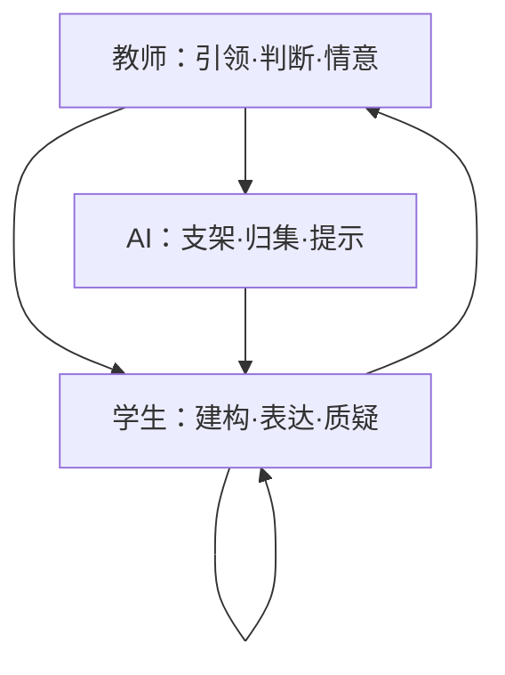
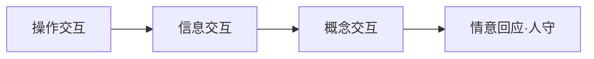
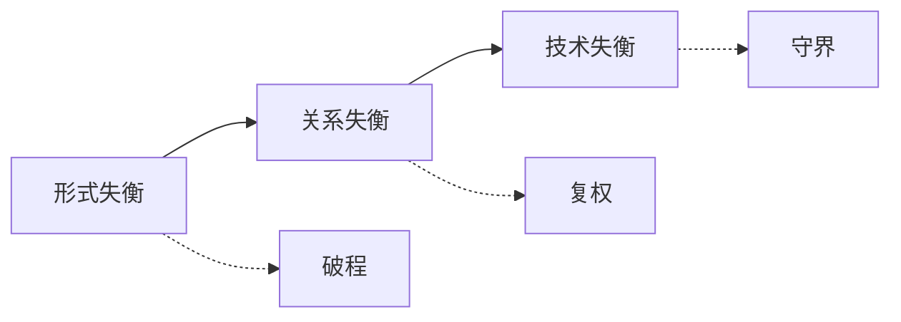

# 图表与工具清单（配套学位论文）

正文以主题合集为主，避免一张一放；下列 20 项覆盖理论、诊断、策略、评价与课例，供制图与答辩对照。无实测数据的条目标注“示意/工具”。

| 序号 | 图名 | 类别 | 目的 | 数据来源 | 类型 | 文中位置 |
| --- | --- | --- | --- | --- | --- | --- |
| 1 | 教学交互层次模型 | 理论 | 操作→信息→概念，并守住情意 | 示意（陈丽层次迁移） | 分层结构图 | 图1 |
| 2 | 课堂现场合集 | 问题诊断 | 座位朝向与发言方向 | 公开教学展示/区域研讨照片 | 四联照片 | 图2 |
| 3 | 三类失衡结构合集 | 问题诊断 | 形式—关系—技术层层加码 | 示意 | 链式+网络 | 图3 |
| 4 | 真实教学材料合集 | 策略/物证 | 板书、观察单、记录卡 | 公开课例材料照片 | 四联材料 | 图4 |
| 5 | 三层×三元×三阶理论模型 | 理论 | 全文核心框架 | 示意 | 结构图 | 图5 |
| 6 | 权责与边界合集 | 策略 | 阶梯、权责、宜做慎做、介入强度、红黄绿灯 | 示意+政策 | 合集 | 图6 |
| 7 | 《即景》破程合集 | 实践案例 | 观察所得进课堂、终稿学生完成 | 公开课例照片 | 四联 | 图7 |
| 8 | 化卡为文与低段通道合集 | 实践案例 | 记录卡→表达；角色扮演横向问答 | 公开课例照片 | 四联 | 图8 |
| 9 | 复权合集 | 实践案例 | 同桌互读、持麦解释、按支架动笔 | 公开课例照片 | 四联 | 图9 |
| 10 | 守界课例合集 | 策略 | 角色陪练+据文追问 | 示意 | 流程+对话 | 图10 |
| 11 | 课例流程合集 | 策略实施 | 火烧云/守株待兔/手指/三段闭环 | 示意 | 流程合集 | 图11 |
| 12 | 成效与观察工具合集 | 数据评价 | 公开朗读反馈、六维雷达、T/S/AI编码 | 公开报道+工具示意 | 合集 | 图12 |
| 13 | 放射状 vs 多回路网络 | 问题诊断 | 互动结构对比 | 示意 | 网络图 | 含于图3 |
| 14 | AI越位四表现 | 问题诊断 | 替答替评替演替证 | 示意 | 结构图 | 含于图3 |
| 15 | 秧田/围坐通道对照 | 问题诊断 | 座位如何收束发言 | 示意 | 对照图 | 含于图3 |
| 16 | 梯度问题链 | 策略 | AI供问、教师守门、先写后比 | 示意 | 层级图 | 含于图11相关脚本 |
| 17 | 学生提问支架转向 | 策略 | 不索要终答 | 示意 | 对照图 | 脚本 fig11 |
| 18 | AI介入强度—主体性 | 评价 | 适切区间示意 | 示意 | 坐标图 | 含于图6 |
| 19 | 课型宜做禁做 | 策略 | 五类课型边界 | 示意 | 矩阵可视化 | 脚本 fig28 |
| 20 | 公开朗读准确率柱图 | 数据 | 侧面说明可重复反馈 | 公开报道（非本文实验） | 柱状图 | 含于图12 |

## Mermaid 草图（可再绘）

## 配套表格（已入正文）

- 表1 三类失衡识别与校准
- 表2 已有研究与本文校准
- 表3 三元权责简表
- 表4 学生向AI提问支架句式
- 表5 课例三元分工
- 表6 课型适配矩阵
- 表7 七维观察量表（0–3分）
- 表8 课中观察简表（编码摘记）
- 表9 课后循证复盘记录表

## 编码定义（摘要）

| 代码 | 定义 |
| --- | --- |
| T1–T5 | 提问、追问、反馈、情感支持、价值判断 |
| S1–S6 | 回答、提问、补充、质疑、合作、创造 |
| AI1–AI5 | 生成、归集、提示、反馈、可视化 |
| 互动链 | T→S；T→AI→S；S→AI→S；S→S；T→S→T |

## 稠密化实拍合集（已剔除无意义图）

| 序号 | 图名 | 联数 | 来源相册 |
| --- | --- | --- | --- |
| 图2 | 课堂现场合集 | 9 | 第一学段／即景／植物／古人（课堂实拍） |
| 图4 | 真实教学材料合集 | 9 | 观察单、记录卡、现场板书、持麦／互读 |
| 图7 | 《即景》破程合集 | 6 | 即景课堂＋观察单／片段 |
| 图8 | 化卡为文合集 | 9 | 植物课堂＋记录卡＋低段角色 |
| 图9 | 复权合集 | 9 | 古人课堂＋《这儿真美》动笔 |
| 图13 | 低段阅读研讨合集 | 4（2×2） | 第一学段课堂实拍 |
| 图14 | 区域习作教研合集 | 9 | 赋能分层＋五校备课课堂 |

**已剔除、不入正文：** 小语名师联盟活动封面、公众号二维码、【板书设计】示意图、推文装饰条、空教室、听课席等。

生成脚本：`scripts/compose_dense_plates.py`；合集输出：`figures/plate_*.jpg`。
