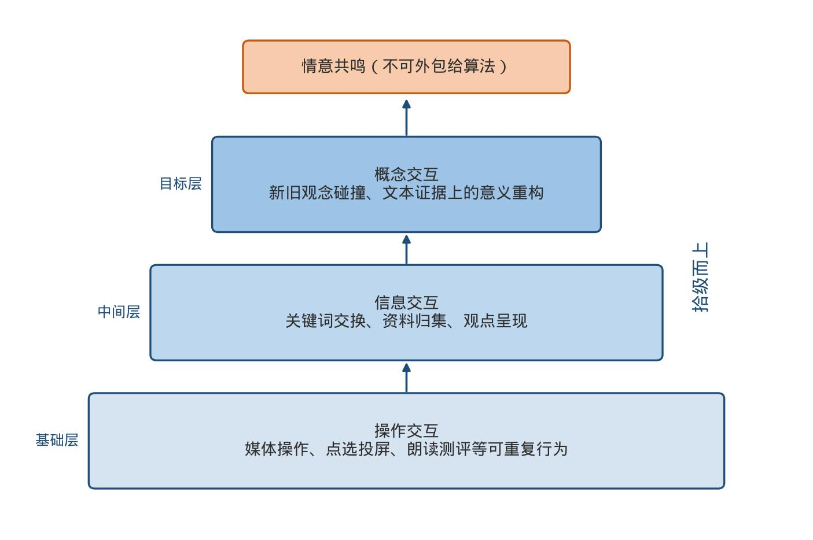
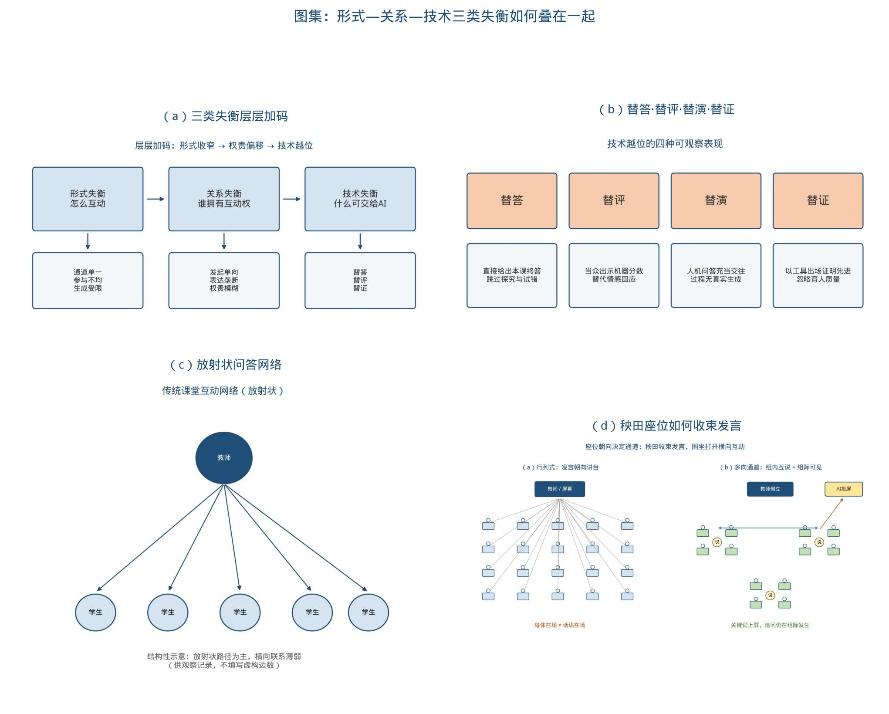
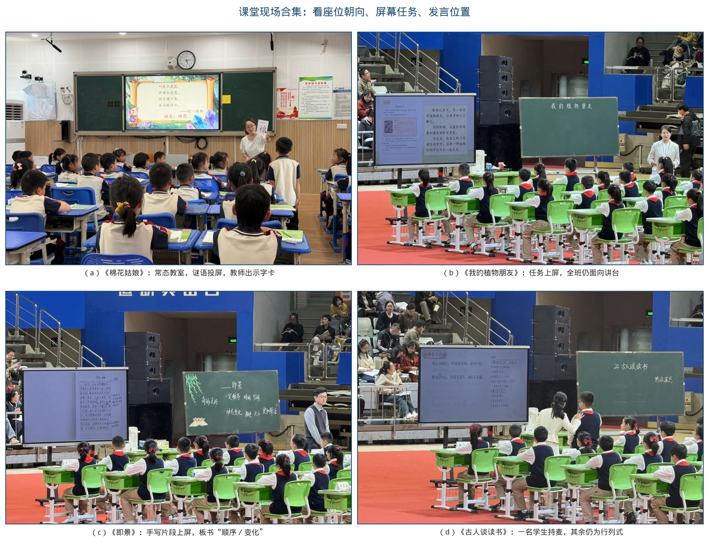
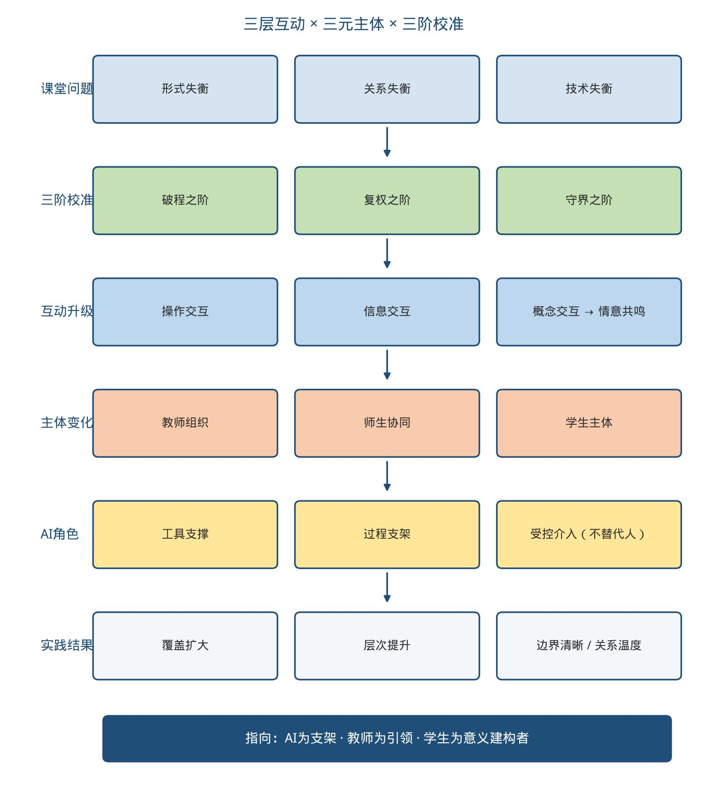
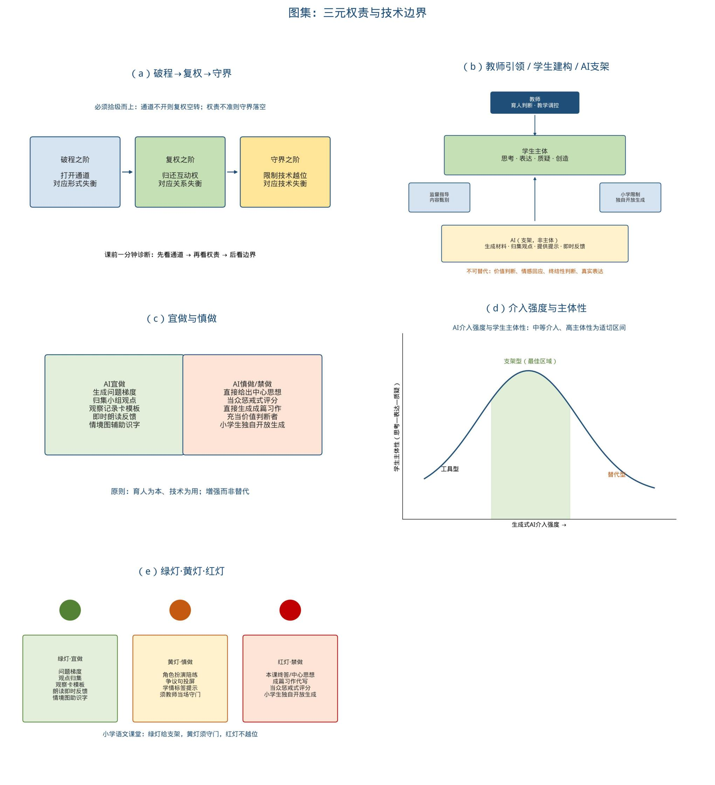
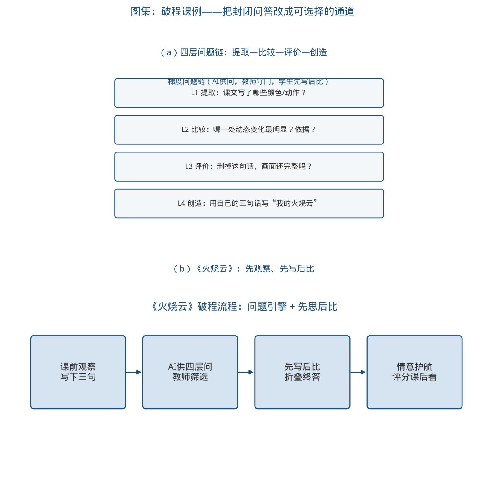
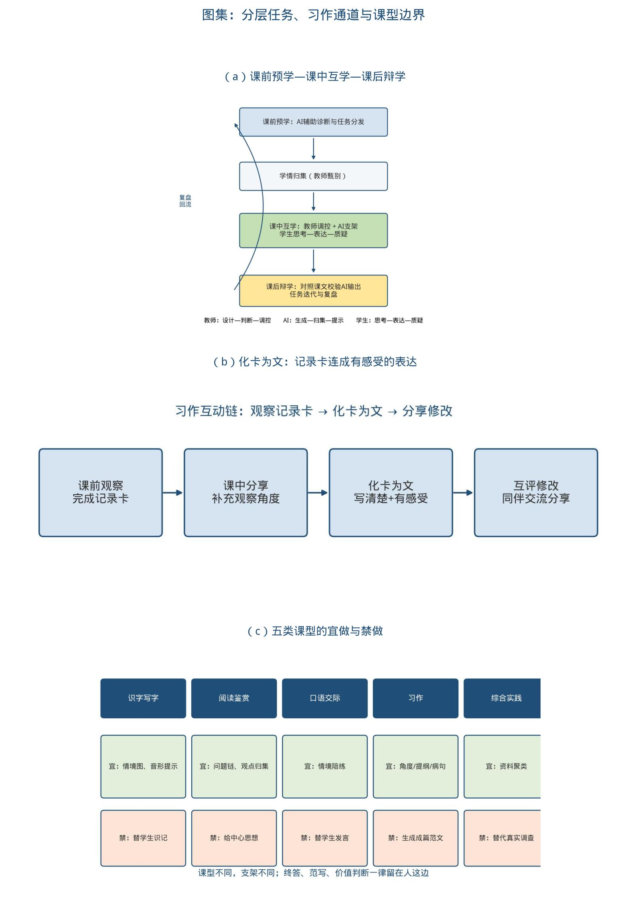
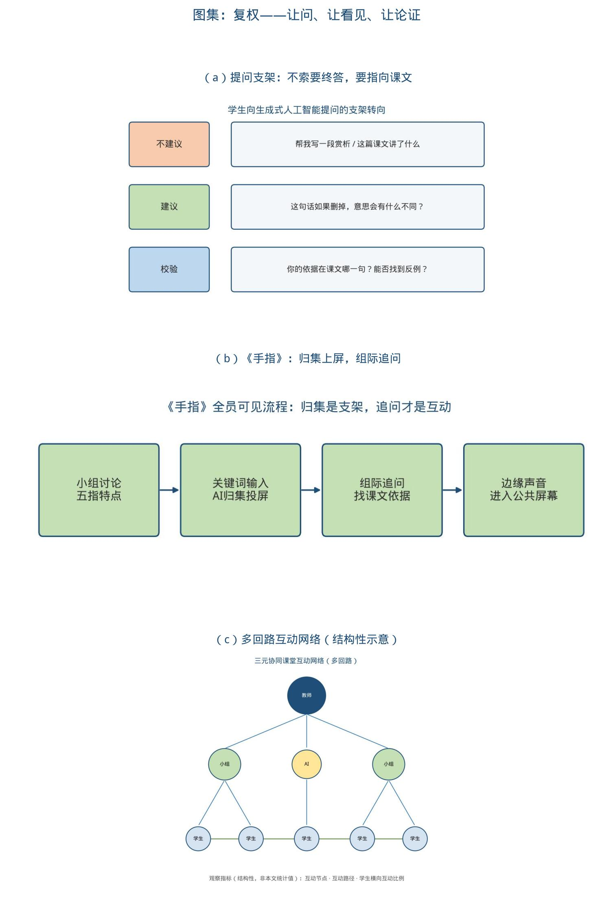
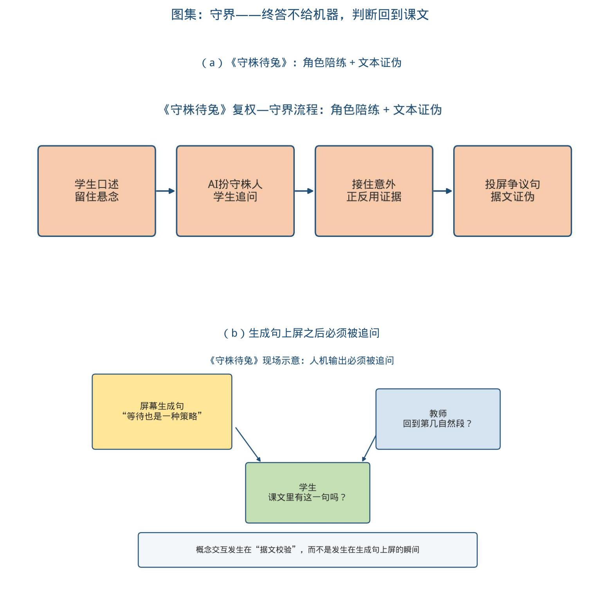
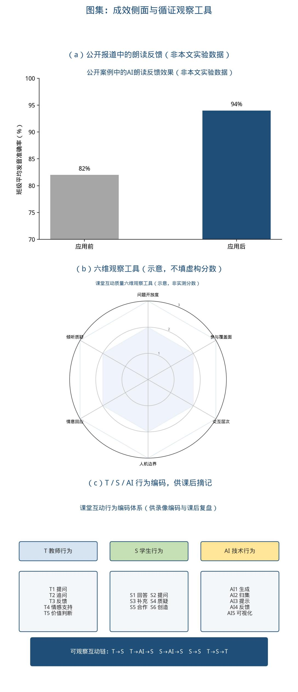

# 失衡·校准·均衡
# ——AI赋能下小学语文三元协同师生互动优化策略

**【摘要】**生成式人工智能进入小学语文课堂后，互动主体由“教师—学生”扩展为“教师—AI—学生”。已有研究较多讨论资源生成、分层练习与习作支架，对课堂互动的通道、权责与越位边界仍缺少可观察的校准框架。课堂观察与课例分析表明：若组织方式、权责关系与技术边界不同步调整，技术在场仍可能固化放射状问答、压缩部分学生的发言机会，并以人机输出代替概念交互与情意回应。《义务教育语文课程标准（2022年版）》强调平等对话；教育部基础教育教学指导委员会《中小学生成式人工智能使用指南（2025年版）》提出“育人为本、技术为用”，明确教师不得将生成式人工智能作为替代性教学主体，小学阶段学生不得独自使用开放式内容生成功能。本文以“问题—策略—结果”为线索，将形式、关系、技术三类失衡分别对应破程、复权、守界三阶校准，提出“三层互动×三元主体×三阶校准”模型，并给出可记录的行为编码与观察量表。本文认为：三元协同不是三方平均用力，而是使AI承担支架、教师承担引领、学生完成意义建构，推动互动由操作交互经信息交互进入概念交互，并由人守住情意回应。证据以课堂观察、课例分析与政策文本为主，公开报道数据仅作侧面说明，不外推为普遍因果效应。

**【关键词】**小学语文师生互动；三元协同；生成式人工智能；互动校准

## 三级目录

一、审视——三元协同课堂互动失衡之困
（一）形式失衡：程式问答，遮蔽多向互动
1. 通道单一：一呼百应，互动难以横向展开
2. 参与失衡：少数发言，主体难以全面进入
3. 生成受限：教案固化，课堂难以容纳意外
（二）关系失衡：主客固化，消解平等交往
1. 发起单向：教师独问，学生习惯被动应答
2. 表达失衡：少数独言，边缘学生持续旁观
3. 权责模糊：技术介入，师生关系反而弱化
（三）技术失衡：工具越位，遮蔽真实对话
1. 替答现象：机器给解，学生跳过自主思考
2. 替评现象：数据代言，情意回应难以替代
3. 替证现象：工具出场，被误认为课堂升级

二、探究——三元协同课堂互动校准之阶
（一）破程之阶：打开通道，让问答走向多向
1. 横向开道：梯度设问，互动得以横向展开
2. 全员入场：分层驱动，主体得以全面进入
3. 生成入课：偏差接住，课堂得以容纳意外
（二）复权之阶：校准主客，让发言走向全员
1. 问权下移：学生追问，改变被动应答习惯
2. 边缘可见：观点上屏，打破持续旁观格局
3. 三元归位：人守判断，防止关系再度弱化
（三）守界之阶：限制越位，让技术回归支架
1. 禁替终答：先思后比，守住自主思考过程
2. 护航情意：出错先护，评分不得当众惩戒
3. 证伪机器：据文校验，破除工具即升级观

三、反思——三元协同课堂互动均衡之效
（一）成效回望：参与拓宽，互动层次拾级而上
1. 行为证据：覆盖提问，同伴追问开始出现
2. 过程证据：文本作证，概念交互开始发生
3. 结果证据：公开案例，仅作侧面增量说明
（二）问题检视：技术惯性，情意回应尚有缺口
1. 惯性犹在：给终答易，给支架难成习惯
2. 素养落差：会操作易，会追问难成全员
3. 评价滞后：看次数易，看情意难入量表
（三）改进前瞻：课型适配，循证复盘持续生长
1. 课型分责：分型定界，识写表达各守边界
2. 观察入表：六维编码，覆盖层次情意对照
3. 单元复盘：支架终答，对照表达循环迭代

## 一、审视——三元协同课堂互动失衡之困
课堂互动不能简化为“提问—回答”的流程执行。符号互动理论指出，人依靠语言、神态与姿态理解彼此意图，并在理解中调整行为。叶子、庞丽娟将师生互动视为教学过程的基本构成，强调其双向、交互与连续性。完整互动至少同时满足三件事：学生是否拥有思考与表达的机会，问题是否来自文本与生活，课堂上是否出现教案之外可被接住的想法。缺一，互动就退回程式。陈丽的教学交互层次塔原用于远程学习，区分为操作交互、信息交互与概念交互。迁移到小学语文面授课时，需要补上两个限定：其一，会点选、会投屏只说明媒体操作已经发生；其二，情意回应无法由算法完整承担，应作为概念交互之后仍须由人完成的一层。本文借用该层次作为“课停在哪一层”的判断尺，而不是把远程学习模型原样套进教室。

**图1　教学交互层次模型（操作—信息—概念，并守住情意共鸣）**

《义务教育语文课程标准（2022年版）》强调平等对话。教育部基础教育教学指导委员会《中小学生成式人工智能使用指南（2025年版）》将生成式人工智能界定为能够生成文本、图片、音频、视频等内容的模型及相关技术，提出“育人为本、技术为用”，要求分学段差异化应用：小学阶段学生应在教师或家长帮助下使用开放式内容生成功能，教师不得将其作为替代性教学主体。UNESCO《教师人工智能能力框架》（2024）指出，人工智能正在使“教师—学生”关系转变为“教师—AI—学生”动态关系，但核心仍是人的主体性、伦理与教学法。黄荣怀把教育数字化的进阶概括为环境建设、资源供给与数字教学法变革：停留在设施与平台，而未进入数字教学法，容易出现高投入、低回报。UNESCO《2023年全球教育监测报告》提醒，教育技术影响的可靠、公正证据仍然不足，技术应为学习服务，而不能取代教与学所依赖的人际连接。

本文采用课例分析、课堂观察、政策文本解读与文献对读。课例来自统编教材常态课与公开教学展示，包括《守株待兔》《火烧云》《手指》《小青蛙》《我们家的男子汉》，习作课《我的植物朋友》《即景》《这儿真美》《奇妙的想象》，阅读课《古人谈读书》《棉花姑娘》《大象的耳朵》等。区域教研中“赋能·分层·共生”的习作集备与“个案—共案—特案—定案”的备课闭环，提供过程性参照。观察用于识别互动结构，不作未交代样本的统计推断。课例只讨论教学设计与互动结构，不标注执教者个人身份。公开报道中的准确率数据标明来源层级，不作为本文实验数据。

近年小学语文领域的生成式人工智能研究，多集中在资源供给、分层练习、提问生成与习作支架。王春梅将其课堂功能概括为资源创新、方法优化与个性化学习，同时指出虚假信息、思维惰化、教师角色转换困难与技术风险。习作方面，贺琳珊、梅培军以童话创编课为例，常见路径是情境生成、即时反馈与智能评改。这些工作可以降低表达门槛，但较少回答三个课堂问题：通道如何从放射状转为多向，发言权如何从少数人回到全员，终答与价值判断如何避免交给机器。本文把祝智庭提出的人机分工底线落实为可观察的校准动作：适合机器做的事交给机器，适合人做的事留给人，二者结合能做得更好的事一起做。

**表1　已有研究关注点与本文校准指向**

| 已有研究常见做法 | 可借鉴之处 | 易出现的缺口 | 本文校准 |
| --- | --- | --- | --- |
| 生成问题库、练习与情境 | 降低备课中的材料准备成本 | 问题仍由教师独问，通道依旧单向 | 破程：梯度供问，先写后比 |
| 观察记录卡、习作支架、智能评改 | 把“写清楚”拆成可操作步骤 | 直接生成成文，或把评改分数当众展示 | 守界：卡与角度可生成，成篇须学生完成 |
| 学情画像、活跃度与正确率统计 | 提示哪些学生尚未开口 | 用数据代替情意研判 | 复权+护航：看见边缘，评分课后看 |
| 人机协同、师—机—生结构论述 | 明确结构已经三元化 | 三方平均用力，权责不清 | 三阶校准：支架、引领、建构各守其位 |

生成式人工智能进入小学语文课堂，不等于互动主体简单增加，而要求组织方式、权责关系和技术边界一并调整。有效的三元协同，不是让教师、AI、学生三方平均用力，而是通过破程、复权、守界，使AI承担支架、教师承担引领、学生完成意义建构，推动互动由操作交互经信息交互进入概念交互，并由人完成情意回应。问题不在“有没有用AI”，而在“谁、在什么场景、缺什么、缺到什么程度”。形式解决“怎么互动”，关系解决“谁拥有互动权”，技术解决“什么可以交给AI”。三类失衡并非并列散落，而是层层加码：通道单一使参与面变窄，参与面变窄使发起权更集中，权责模糊后又使生成式工具以更流畅的界面完成替答、替评与替证。

**图2　三类失衡合集：（a）层层加码；（b）四种越位；（c）放射状问答；（d）秧田座位如何收束发言**

现场照片与结构图承担不同证据功能。结构图标明层次与权责；照片核对座位朝向、屏幕任务与发言位置，不能单独证明概念交互已经发生。图3将四张现场并置：常态教室里谜语投屏与字卡出示，可以把第一学段识字通道打开，但互动仍是教师对全体；展示课若摆在体育馆里，行列式课桌同样把发言收束到讲台一线——手写片段上屏、记录任务写清、个别学生持麦，都不等于横向通道已经打开。

**图3　课堂现场合集：（a）《棉花姑娘》；（b）《我的植物朋友》；（c）《即景》；（d）《古人谈读书》**

### （一）形式失衡：程式问答，遮蔽多向互动
形式失衡的突出表现，是把互动收窄为“教师一呼、学生百应”的放射状问答，多向通道尚未打开，深度互动被流程挡住。

#### 1. 通道单一：一呼百应，互动难以横向展开
走进统编教材三年级下册寓言阅读课，常见场景是：教师站在投影中央抛出“这个故事告诉我们什么道理”，全班齐答“不能心存侥幸”，个别表达流畅的学生补充一句“要靠劳动”，教师点头进入下一环节。教师与全体、教师与个别两条通道占满课时，教师与小组、生生、组际的横向互动明显不足。图3（a）（c）中的行列式座位说明，通道单一并不因“展示课”自动消失。若此时直接投出生成式工具给出的“标准寓意”，学生跳过涵泳与试错，程式被包装得更流畅。齐声应答往往意味着主体并未真正进入对话。

#### 2. 参与失衡：少数发言，主体难以全面进入
在秧田式座位与教师独占讲台的空间结构中，身体在场并不等于话语在场。持续观察可见：部分学生整节课缺少有效口头互动机会，内向学生与表达较弱的学生在放射状问答中更容易处于旁观位置。此处不将“近三分之一”作为未交代样本量、观察课数与操作性定义的统计数据。可观察的事实是：发言机会向少数教师较为熟悉、表达流畅的学生集中；小组合作中常见“一人说、众人听”。小学生面对同伴本更敢提问、敢纠错，多数课堂却压缩合作探究。生成式工具本可归集不同想法，若只用来做习题训练与投屏，技术在场而通道仍旧只有一条。图2（d）把秧田与围坐对照画出：箭头全部指向讲台时，边缘座位很难进入公共对话。

#### 3. 生成受限：教案固化，课堂难以容纳意外
教师担心小组活动打乱节奏、耽误知识点落实，于是把问答流程写进教案的每一分钟：先问什么、谁来答、标准句是哪一句，全部预置。课堂把有序当作唯一目标，容不得对话中的不确定。教案执行完毕，互动往往也被宣告完成。形式失衡看起来是问法单一，根子是不敢把时间交给尚未写进教案的对话。若在此时用生成式人工智能预先生产“标准赏析”，生成空间会进一步缩小。

### （二）关系失衡：主客固化，消解平等交往
完整互动包含认知互动、情意互动和行为互动。关系失衡的突出表现，是发起权、可见权与判断权持续集中于教师及少数学生，平等交往难以落实。

#### 1. 发起单向：教师独问，学生习惯被动应答
教师始终是问题发起者，学生只是执行者。问点落在字词句篇的标准解释上，学生出错时急于纠正答案，缺少情绪安抚，更少把时间交给学生展示个性化的态度与学习方式。情感态度成为认知的附属。部分教师把生成式工具当作强化自身输出的扩音器：同一段赏析，过去写在教案里，现在由机器读出来，主客关系不仅没有松动，反而被“更正确的声音”加固。与预设不合的想法，常被一句“我们下课再聊”绕开。

#### 2. 表达失衡：少数独言，边缘学生持续旁观
垄断化交往与主客化关系缠在一起。课堂发言集中于少数学生；小组内可见“一人说、众人听”。互动大多在浅层进行：缺少深层次探究、思维碰撞与情绪激动。若只把“活跃者”的答案投上屏幕，边缘学生被看见的机会不会自动增加。图3（d）中一名学生持麦克风，其余学生仍坐成秧田，说明个别位置的复权，不等于全员通道已经打开。应然状态是：学生面向同伴表达，教师退到一侧倾听，屏幕仅承担支架功能。

#### 3. 权责模糊：技术介入，师生关系反而弱化
教师若把师生互动等同于课堂提问，交往就难以进入教学过程的基本构成。评价仍优先看进度与知识点覆盖，教师担心开放探究耽误课时。学生的倾听、表达、反思、合作缺少常态训练，给了机会也不容易形成高质量对话。生成式人工智能介入后，若提问权、评价权进一步让给机器，师生关系会被稀释：教师从对话者变成播放者，学生从建构者变成校对者。

### （三）技术失衡：工具越位，遮蔽真实对话
技术失衡不是“用了AI”，而是AI从支架变成越位的判断者：代替学生思考，代替教师判断，用人机问答充当师生之间的情意交流。图2（b）把四种越位画在同一视域里，便于课中对照。

#### 1. 替答现象：机器给解，学生跳过自主思考
课堂上可见：学生对着屏幕读出标准赏析，教师点头，进入下一题。主体看似都在场，情境却不真实，过程更无生成。让生成式工具直接输出寓意、中心思想或范文，学生跳过探究与试错。这与《使用指南》禁止把生成内容直接作为作业或考试答案、限制在创造性任务中滥用人工智能的要求相悖，也直接阻断概念交互。

#### 2. 替评现象：数据代言，情意回应难以替代
用机器评分、活跃度统计代替教师的情感回应，是第二类越位。机器可以提示对错，却读不懂一个孩子为什么突然不说话。活跃度低可能是性格原因、准备不足或问题过难，一个数字代替不了现场研判。当众展示带羞辱性的语音测评分数，会使学生下次更倾向选择安全答案，情意互动随之收缩。

#### 3. 替证现象：工具出场，被误认为课堂升级
把是否使用生成式人工智能当作课堂先进的证明，是第三类越位。人与技术的互动若引导不当，会高度集中于媒体演示、即时检索等操作层面，用于创作、表达、质疑的互动偏少。操作交互的流畅，不能等同于概念交互的发生。权责边界一旦模糊，AI就会从支架变成课堂上的越位判断者。情感体察与价值判断仍须由人完成。

**表2　三类失衡、识别信号与校准指向**

| 失衡类型 | 核心问题 | 可观察信号 | 校准指向 |
| --- | --- | --- | --- |
| 形式失衡 | 怎么互动 | 放射状问答、横向通道不足、教案不容意外 | 破程之阶：打开通道 |
| 关系失衡 | 谁拥有互动权 | 教师独问、少数独言、边缘学生旁观 | 复权之阶：归还权责 |
| 技术失衡 | 什么可以交给AI | 替答、替评、替演、替证 | 守界之阶：限制越位 |

## 二、探究——三元协同课堂互动校准之阶
针对形式、关系、技术三类失衡，策略按“破程→复权→守界”拾级而上，并提升为全文核心模型：三层互动×三元主体×三阶校准。通道不开，权责校准会变成新的点名游戏；权责不校准，守界只会停在口头提醒；边界不守，前两阶都会被更流畅的标准答案吞掉。

**图4　AI赋能小学语文“三元协同”师生互动优化理论模型**

UNESCO指出，AI使教学关系转为教师—AI—学生动态结构，但教师仍须具备人本取向、伦理判断与AI教学法。与此相应，三元协同并不等于三方平均用力。低年段学生操作能力有限，开放式生成应由教师发起并监护；中高年段逐步把提问权、校验权交给学生，教师更多承担问题守门人与价值把关人。边界随学段调整，底线不变。图5把阶梯、权责、宜做慎做、介入强度与红黄绿灯放在同一图集中，便于课前一分钟对照：先看通道开没开，再看权责正不正，后看边界守没守。

**图5　权责与边界合集：（a）三阶校准；（b）三元权责；（c）宜做慎做；（d）介入强度；（e）绿灯黄灯红灯**

**表3　“教师—AI—学生”课堂互动权责简表**

| 主体 | 主要权责 | 不可越位之处 |
| --- | --- | --- |
| 教师 | 目标设计、价值引领、情感沟通、即时调控、甄别生成内容 | 不把育人判断交给算法 |
| AI | 素材与情境生成、学情归集、观点汇总、分层提示、可重复反馈 | 不直接给出本应由学生完成的终答 |
| 学生 | 自主探究、同伴协作、有效提问、校验信息、真实表达 | 不照搬生成语句代替自己的思考 |

### （一）破程之阶：打开通道，让问答走向多向
对应形式失衡：把单通道改成可选择、可生成、可延伸的多向通道。本阶先改问题、改任务、再改生成——通道一开，程式才松动。

#### 1. 横向开道：梯度设问，互动得以横向展开
减少“是不是、对不对”的封闭式问题，改用有包容性的发散问题，让学生做策略与思路的选择。生成式工具可用于生成问题梯度，但须限定：只提供问题与材料线索，不输出最终赏析。操作分四步：第一，教师确定本课核心概念；第二，请工具按由易到难生成四层问题，教师删掉“标准答案型”设问；第三，学生先独立写关键词、同桌互说，再全班比读；第四，所谓“标准描写”先折叠，学生写完再打开，作对比而不作范本。

**【案例举隅1】三年级下册《火烧云》：先观察表达，后让AI供问**
课前布置学生观察晚霞，写下三句“我的火烧云”。课中请生成式工具按“颜色变化—形状联想—动态用词—情感余味”生成四层问题，教师筛选后投屏。规则写明：问题可以借用，“标准描写”先不看。表达较弱的学生抓住颜色词就能开口，表达较强的学生可以讨论动态与想象。梯度问题把互动从“猜老师要的答案”拉向“我能说一层、再进一层”。若一上课就投出“标准美文”，通道瞬间重新闭合。

**【案例举隅1-2】五年级上册习作《即景》：观察记录单驱动动态描写**
《即景》要求观察一种自然现象或一处景观，按一定顺序写出景物的动态变化。可操作的破程做法是：课前完成观察记录单，课中先比较判断何为“眼前的、当下的景”，再交流心动时刻并补全题目；默读习作教材圈画“顺序”与“变化”两类要求；回看记录单确定时间顺序或空间顺序；迁移单元课文《鸟的天堂》《月迹》中声音、数量、光影等动态写法，重点修改“变化是否写出来”。屏幕可以投出学生片段作讨论对象，黑板则把“一定顺序／动态变化”写成可见支架。生成式工具此时只宜提供观察角度提示或动态动词清单，不宜直接生成成篇即景作文。图3（c）显示：材料已经公共化，若座位仍全部朝向讲台，讨论还可能停在“看屏幕”。

**图6　破程课例合集：（a）四层问题链；（b）《火烧云》先写后比**

#### 2. 全员入场：分层驱动，主体得以全面进入
通道不仅要在空间上打开，还要沿任务分层覆盖不同学生。低年级适宜同桌两人合作：互说思考过程、互查、互提问题；高年级适宜多人小组，兼顾组际通道。利用生成式工具完成任务分发与观点归集，形成“课前预学—课中互学—课后辩学”闭环。工具进课堂要有流程：先明确任务，再决定何时调用、何时必须回到文本与同伴。

**【案例举隅2】四年级下册《我们家的男子汉》：三层任务与“我与AI辩论”**
围绕“课文怎样写出一个孩子的成长味道”，设置三层任务：A层找出写“男子汉”言行的句子并朗读；B层小组讨论作者为什么用这一称呼；C层尝试用一段话写“我们家的——”。生成式工具按层次推送提示卡（不含现成赏析）。课后布置“我与AI辩论”：学生先写约100字感受，再请工具写一段同题文字，用红笔标出“我同意／我不同意／课文里有证据吗”。分层不等于降低要求：A层同样要被追问“为什么这样读”。小学阶段该任务须在教师组织下完成，避免学生独自使用开放式生成。

**【案例举隅2-2】三年级下册习作《我的植物朋友》：化“卡”为“文”**
本课的学情难点是观察角度单一、不会把记录卡连成连贯表达。互动设计分成三步：先分享植物记录卡，交流“从哪些方面观察”；再全班补充记录卡，拓宽选材；然后从卡中选1—2个方面化“卡”为“文”，要求写清楚观察到的，并试着写出感受。关联精读课文《荷花》的多感官写法，把“看、闻、摸”变成可选择的表达路径。写同一植物的同学可以合作分享。生成式人工智能可以提示观察角度或把学生口语转成提纲，但终稿必须由学生完成。区域习作集备中“赋能·分层·共生”的取向与此一致：支架分层供给，互评修改共生，而不是用同一篇范文覆盖全班。图3（b）屏幕已写明“借助记录卡……读给同学听”，画面却停在教师布置、全班听讲，说明任务文本上屏并不等于同伴通道已经打开。

一年级识字课打开通道，不宜一上来就“人机辩论”。一年级下册识字3《小青蛙》，教师用生成式工具生成“小青蛙在清清的河边看晴天”的连贯情境图，把“青、清、晴、情、请”放进同一幅画。识字仍按“知其音、识其形、明其义”推进。图画是帮手，不是课堂的主角。判断标准只有一个：学生是否因此更愿意读、更敢于说。

第一学段阅读同样要用情境打开通道，而不是用生成文本代替朗读。一年级下册《棉花姑娘》以谜语导入、角色扮演和对话朗读落实“读好请求语气”；二年级下册《大象的耳朵》抓住问号、语气词与疑问词读好角色对话，并在小组合作中体会“不盲从、善思考”。低段阅读的互动质量，首先看学生是否读出角色心情，而不是屏幕上是否出现标准解释。

**图7　分层与习作合集：（a）三段闭环；（b）化卡为文；（c）五类课型宜做与禁做**

#### 3. 生成入课：偏差接住，课堂得以容纳意外
优质课堂是预设与生成的辩证统一。备课宜粗备框架、细留空间：课前用生成式工具生成多套问题链与备选语料；课中一旦出现教案之外的问题，调用工具获取多角度参考，但不直接宣读答案，而把它变成研讨引子。接住的标志是：把学生的那句话写上黑板，追问“课文里有没有依据”，再决定要不要补充材料。

**【案例举隅3】三年级下册《守株待兔》：一句“也许他只是太累了”**
课堂上，一名学生提出：“守株人也许只是太累了，想歇一歇。”这显然偏离教案预设。教师没有急于纠偏，而是追问：“课文里有没有写他累？如果没有，你觉得作者为什么要把这个故事写得这么夸张？”随后补充“寓言中的夸张手法”与“生活中的侥幸心理”两类材料，组织正反两方用课文语句说话。生成的偏差被转化为教学资源：教师没有否定学生，也没有让机器给终答，而是把讨论拉回文本证据。

### （二）复权之阶：校准主客，让发言走向全员
对应关系失衡。通道打开之后，若权责仍旧“师发生从”，多向互动会迅速被少数学生重新垄断。本阶把发起权、可见权、判断权校准回来。

#### 1. 问权下移：学生追问，改变被动应答习惯
主客化关系的深层结构，是提问权始终在教师手里。复权的关键，是把“问”教给学生，并规定：向生成式工具提问，不得直接索要终答。课前用微型课训练句式，把句式贴在语文书首页。

**表4　学生向AI提问的支架句式**

| 使用场合 | 不建议这样问 | 建议这样问 |
| --- | --- | --- |
| 预习阶段 | “这篇课文讲了什么？” | “课文中哪几处写到了××？分别在第几段？” |
| 阅读探究 | “帮我分析这句话的作用。” | “这句话如果删掉，意思会有什么不同？” |
| 表达交流 | “帮我写一段关于××的话。” | “我的这段文字，哪里写得还不够清楚？” |
| 校验信息 | “你说得对吗？” | “你的依据在课文哪一句？我能不能找到反例？” |

**【案例举隅4】四年级下册《我们家的男子汉》：把提问方法教给学生**
在“我与AI辩论”前，教师把“帮我写一段”改成“课文中哪些句子写出了他的成长”。课中设三道闸：提问须先指向课文某段某句；生成内容必须当众被追问“依据在哪”；每组设一名“沉默观察员”记录谁还没说话。全员不是平均发言秒数，而是没有人被固定排除在对话之外。

**【案例举隅4-2】五年级上册《古人谈读书》：先问后解，联系自己的读书生活**
本课说理性强、语录句之间关联不高，学生不容易主动关联已有读书经验。可把提问权前移：初读后同桌互读互评；自读提出疑问，再借助注释在小组内理解大意；用表格梳理朱熹“心到、眼到、口到”的关系；最后联系自己的读书生活谈启发，并拓展迁移。学习任务单和空白书签用于让每个学生留下自己的问题与收获。生成式工具可以提供注释对照或朗读停顿示例，但不能代替学生说出“我读到了什么、我以后怎么读”。图3（d）中学生持麦克风面对屏幕解释语录，互动已从教师独讲转为学生论证，其余座位仍提醒：复权还要继续推向全员。

#### 2. 边缘可见：观点上屏，打破持续旁观格局
垄断化交往的破解，不是多点几个名字，而是让每一个想法被看见。生成式工具把小组观点可视化，帮助内向学生进入公共屏幕；教师组织互评、追问与归纳。投屏不是展览，而是下一次对话的起点。三年级习作《这儿真美》把教材例文作为“围绕一个意思写”的支架，再用评价量规组织练笔与修改，使边缘学生也能按可见标准进入表达，而不是等待教师点名。

**【案例举隅5】五年级下册《手指》：让每个组的想法都出现在屏幕上**
小组合作学习“五根手指各有什么特点”后，各组把关键词输入学习平台，工具按“姿态、作用、性格”三类归集并投屏。教师不评价哪一组更好，而是先请一组说明归类理由，再请另一组补充或反驳，最后请全班为关键词找出课文依据。归集是可重复劳动，冲突处理才是教师的专业工作。

**图8　复权合集：（a）提问支架转向；（b）《手指》归集与追问；（c）多回路互动网络**
观察时记录互动节点、互动路径与学生横向互动，作为结构性指标，不在此填写虚构统计值。

#### 3. 三元归位：人守判断，防止关系再度弱化
课堂上是否真正复位，只看两个瞬间：当学生说出与预设不同的答案时，教师是接住还是绕开；当生成式工具给出看似标准的解读时，教师是宣读还是追问。

**【案例举隅6】三年级下册《守株待兔》：AI扮角色，教师守寓意**
课中不急于揭示“不可心存侥幸”，先请学生用自己的话说故事。随后请工具扮演“守株人”，用第一人称辩解。学生分组追问：庄稼谁来种？兔子会再来吗？工具只负责把各组问题归类投屏，教师抓住“侥幸—劳动—事理”组织班级对话，并提醒：它可以“变成”故事里的人物，却不能替我们判断对错。生成式人工智能能够依据语言模式生成具有较强连贯性的解释，但其生成结果并不天然等同于文本意义本身。因此，教师需要将输出重新置于文本证据之中，由学生通过比照、质疑和论证完成意义判断。

### （三）守界之阶：限制越位，让技术回归支架
对应技术失衡。通道有了，权责明了，若没有不可逾越的边界，生成式工具仍会以更精致的方式替答、替评、替演、替证。

#### 1. 禁替终答：先思后比，守住自主思考过程
边界约定一：可以给问题、给材料、给归集，不可以给本课终答。操作上把“标准赏析”折叠到学生独立表达之后，只作对照。习作课同样如此：观察角度、情节提示与病句提醒可以生成，成篇文字须由学生完成。这与小学阶段限制独自开放生成、禁止复制生成内容作为作业答案的政策要求一致，也针对已有研究中“照抄生成结构与语句”的惰化风险。

#### 2. 护航情意：出错先护，评分不得当众惩戒
学生读错、说错时，先保护自尊心，再引导回到文本。约定三条：当众不展示带羞辱性的机器分数；先问“你刚才看到了什么／想到了什么”，再范读或同伴带读；分数与等级留到课后单独查看，并与下一次进步对照，而不是与全班排名对照。边界约定二：机器评分可以课后看，不可以当众作为惩戒。

**【案例举隅7】三年级下册《火烧云》：不让机器评分当众挫败学生**
朗读展示环节，一名学生把比喻读破了句子，语音测评给出较低分数。教师没有展示分数，而是先问：“你刚才看到了什么颜色？”肯定观察，再请他跟着范读。这一处理守住互动底色：一旦机器评价当众生效，学生下次会更倾向于选择安全的答案。

#### 3. 证伪机器：据文校验，破除工具即升级观
对生成的释义、赏析、学情标签尤须审慎：活跃度低不能直接等同于“不认真”。更关键的示范是：当着学生的面质疑生成内容，用课文证伪“很会说话”的句子。边界约定三：任何生成句子上屏，都必须经过“课文里有没有依据”这一问。

**【案例举隅8】三年级下册《守株待兔》：用文本证据否定“正能量改写”**
课后拓展时，有工具把寓言解读为“等待也是一种策略，机会总是留给有准备的人”。教师把这句话投在屏幕上，请学生回到课文找依据：庄稼完了没有？邻居怎么说？宋人最后的结果是什么？学生很快发现，文本里没有任何一处支持这种解读。教师小结应落在可检验的论断：生成文本可以流畅，但不等于已经完成对该课文的意义建构；读书的人要自己判断。当学生看到教师当场质疑工具，“机器说的就是对的”这一默认印象才会松动，思维互动才进入概念交互。

**图9　守界课例合集：（a）《守株待兔》流程；（b）生成句上屏后必须被追问**

素养培基要把提问句式、倾听规则与“先找课文、再看机器”的校验习惯做成单元常规。九个课例的分工可收束如下。

**表5　主要课例的三元分工与互动升级点**

| 课例 | 主要互动设计 | AI承担 | 互动升级点 |
| --- | --- | --- | --- |
| 《火烧云》 | 梯度设问，先写后比 | 生成问题梯度 | 由浅层应答转向多层表达 |
| 《火烧云》二 | 不当众展示机器评分 | 语音测评（课后查看） | 由评价驱动转向情感支持 |
| 《守株待兔》 | AI扮角色，学生追问 | 角色辩解、问题归类 | 由听讲转向质疑与论证 |
| 《守株待兔》二 | 接住意外疑问 | 补充两类材料 | 由执行教案转向生成 |
| 《守株待兔》三 | 用文本证据质疑生成内容 | 生成争议性解读 | 由接受结论转向批判思维 |
| 《手指》 | 小组关键词归集投屏 | 归集与可视化 | 由少数发言转向全员表达 |
| 《小青蛙》 | 情境图助识字 | 生成连贯情境图 | 由机械识记转向语境识字 |
| 《我们家的男子汉》 | 三层任务＋课后辩论 | 分层提示卡 | 由课中互动转向链环互动 |
| 《即景》 | 观察记录单＋动态描写 | 观察角度／动词提示（不生成成文） | 由静景罗列转向变化表达 |
| 《我的植物朋友》 | 化卡为文＋同伴分享 | 观察角度提示 | 由记录转向连贯表达 |
| 《古人谈读书》 | 自读提问＋联系读书生活 | 注释对照、停顿示例 | 由听讲转向质疑与迁移 |
| 《棉花姑娘》《大象的耳朵》 | 情境朗读、角色对话 | 不替代朗读体验 | 由认读转向语气与思维 |
| 《这儿真美》《奇妙的想象》 | 写作支架＋评价量规＋互评 | 不提供范文终稿 | 由教师改文转向学生修改 |

## 三、反思——三元协同课堂互动均衡之效
校准是否有效，不能只看“这节课用了生成式人工智能没有”，而要按证据等级与“过去—现在—未来”两套逻辑同时审视。本文将证据分为三层。第一层为课堂行为证据：发言覆盖、学生主动提问、同伴追问、对生成内容的校验。第二层为学习过程证据：问题层级、文本证据使用、修改与质疑次数。第三层为学习结果证据：表达质量、阅读理解、朗读表现、学习兴趣。本文主要采用课堂观察、案例分析与教学实践记录，不将有限课例的变化直接外推为普遍因果效应；亦不在未交代观察班级数、学生人数、课节数、时间窗口、沉默的操作性定义与编码规则的情况下，把“近三分之一沉默”或未说明量表的“兴趣前后测”作为统计结论。

### （一）成效回望：参与拓宽，互动层次拾级而上
就已开展的课例实践与课堂观察而言，可报告的是结构与行为层面的变化方向，而不是未完成抽样设计的参数估计。

#### 1. 行为证据：覆盖提问，同伴追问开始出现
过去，放射状问答使部分学生整节课缺少有效发言机会，小组里“一人说、众人听”。现在，任务分层保证人人有事可做，观点归集使每一组关键词进入屏幕，“我与AI辩论”把表达权延到课后。观察中可见：内向学生不必第一时间当众成段发言，也可以经由小组输入被看见；主动提问与同伴追问开始从个别课例中稳定出现。覆盖面的意义不在热闹，而在边缘学生不再被固定排除。

#### 2. 过程证据：文本作证，概念交互开始发生
过去，互动在“找出关键词、齐答道理”的信息层循环。现在，《守株待兔》里学生用课文证伪生成式“正能量改写”，《火烧云》《即景》里先观察、先写后改而不把机器美文当范本，《我的植物朋友》里把记录卡化成有感受的连贯表达，《古人谈读书》里学生提出疑问并联系自己的读书生活——这些行为落在分析、评价、质疑区间，是信息交互向概念交互的跃迁。

#### 3. 结果证据：公开案例，仅作侧面增量说明
第三层学习结果证据，本文不以自制前后测冒充实验。侧面说明可引用已公开的教学报道：北京师范大学京师附属小学在三年级《在牛肚子里旅行》等相关朗读实践中，报道称一篇课文预习的班级平均发音准确率由初测82%提升至课后测94%，并强调教师据此把握共性问题、组织课堂指导。该数据来自公开报道，仅用于说明“AI可承担可重复的朗读反馈、教师仍须组织教学与情感回应”，不作为本文实验数据，也不能直接推广到阅读鉴赏或习作课型。

### （二）问题检视：技术惯性，情意回应尚有缺口
均衡是目标，不是已经完成的状态。目前仍有三处缺口没有闭合。

#### 1. 惯性犹在：给终答易，给支架难成习惯
公开课、研究课上，教师能守住“不给终答”；回到日常进度压力下，仍容易随手投出标准解读，以换取“这节课讲完了”。给支架比给终答更费时间：要筛选问题、折叠答案、组织比读。技术惯性与进度焦虑叠在一起，破程之阶就会回潮为更精致的程式化。

#### 2. 素养落差：会操作易，会追问难成全员
学生会打开学习平台、会输入关键词，不等于会提出“这句话如果删掉会怎样”的问题。提问句式训练在部分课例中有效，但尚未变成年级常规；部分学生仍把生成式工具当成“代写器”。倾听、反省、合作的能力落差，使全员可见停留在“屏幕上有名字”，尚未达到“每个人都能追问一句”。复权之阶在工具层走得快，在素养层走得慢。

#### 3. 评价滞后：看次数易，看情意难入量表
学校与教研评价仍习惯统计发言次数、工具出场、知识点覆盖。情意回应——学生出错时是否被保护、是否敢于再试一次——很难进量表，于是温度护航常被看成“教师风格”而非必须达标的互动质量。以用代证的评课习惯没有根除，守界之阶就缺少制度支持。数据可以提示“发生了什么”，不能代替教师判断“该不该这样互动”。

### （三）改进前瞻：课型适配，循证复盘持续生长
面向未来，要把已经有效的校准动作做成不同课型可执行、每单元可复盘的日常。

#### 1. 课型分责：分型定界，识写表达各守边界
下一步按课型写清人机分工，避免“所有课都用同一种生成方式”。识字写字重情境与即时反馈，阅读鉴赏重问题与可视思维，口语交际重真实交流，习作重独立表达与修改，综合实践重真实探究。终答、范写、价值判断一律留在人这边。图7（c）已把五类课型的宜做与禁做画在同一视域，便于教研对照。

**表6　课型适配矩阵（策略落地总表）**

| 课型 | AI宜做 | AI慎做 | 教师重点 | 学生核心任务 |
| --- | --- | --- | --- | --- |
| 识字写字 | 情境生成、字形提示 | 直接替学生识记 | 音形义把关 | 观察、辨析、运用 |
| 阅读鉴赏 | 问题生成、观点归集 | 直接生成中心思想 | 追问、证据判断 | 批注、质疑、论证 |
| 口语交际 | 情境模拟、角色陪练 | 替学生完成表达 | 组织真实交流 | 表达、倾听、回应 |
| 习作 | 观察角度提示、提纲反馈、病句提醒 | 直接生成成文或“标准范文” | 指导构思、量规互评与修改 | 观察记录、独立表达、修改 |
| 综合实践 | 资料整理、信息聚类 | 替代真实调查 | 任务设计与价值判断 | 探究、协作、创造 |

#### 2. 观察入表：六维编码，覆盖层次情意对照
把评课从“用了几个工具”转到可观察、可记录、可复盘的工具。六维雷达图仅作评价框架示意，不填写无完整数据的实验前后分数；批判校验单列于量表，供课后摘记是否质疑生成内容。弗兰德斯互动分析系统（FIAS）以及顾小清等改进的ITIAS，把课堂言语分成教师语言、学生语言与沉寂或技术等类别。生成式人工智能进场后，原有编码对“技术”过于笼统。本文在教师—学生轴上增列AI行为（生成、归集、提示、反馈、可视化），并规定可观察互动链：T→S、T→AI→S、S→AI→S、S→S、T→S→T。编码供录像摘记与课后复盘使用，不在未完成一致性检验时报告比率。

**图10　成效与观察工具合集：（a）公开朗读反馈（非本文实验）；（b）六维观察示意；（c）T/S/AI编码**
数据来源：首都之窗等对京师附小相关教学展示的公开报道。

**表7　AI赋能小学语文课堂互动质量观察量表**

| 维度 | 观察指标 | 0分 | 1分 | 2分 | 3分 |
| --- | --- | --- | --- | --- | --- |
| 问题开放度 | 是否存在分析、比较、评价、创造问题 | 无 | 偶有 | 较多 | 连续出现 |
| 参与覆盖 | 是否突破少数学生发言 | 严重集中 | 较集中 | 基本覆盖 | 高度覆盖 |
| 互动层次 | 是否由信息交互进入概念交互 | 操作 | 信息 | 概念 | 概念+情意 |
| 学生主体 | 学生是否主动提出问题 | 无 | 偶有 | 较多 | 稳定发生 |
| 人机边界 | AI是否替代学生思考 | 明显越位 | 偶有 | 基本合理 | 清晰受控 |
| 情意回应 | 学生受挫后是否获得支持 | 无 | 较少 | 较充分 | 持续发生 |
| 批判校验 | 是否质疑AI输出 | 无 | 偶有 | 较多 | 常态化 |

**表8　课中多向互动观察简表（供教师课后复盘）**

| 观察项目 | 观察要点 | 等级（优／良／待改进） | 编码摘记 |
| --- | --- | --- | --- |
| 问题开放度 | 是否出现需要分析、比较、创造的发散性问题 |  | T1/T2 |
| 参与覆盖面 | 发言是否超出少数固定学生，小组是否人人有任务 |  | S1/S5 |
| 交互层次 | 是否从操作交互、信息交互进入概念交互 |  | S4/S6 |
| 人机边界 | 是否只提供支架，终答是否由学生完成 |  | AI1–AI5 |
| 情意回应 | 学生受挫或出错时是否保护自尊并继续对话 |  | T4 |
| 倾听与质疑 | 是否出现同伴追问、补充或对生成内容的校验 |  | S2/S3/S4 |

#### 3. 单元复盘：支架终答，对照表达循环迭代
策略要在一课一课的磨砺中生长。区域习作教研已形成可迁移的备课闭环：个人初备形成个案，集体研讨形成共案，个性化修改形成特案，课后反思形成定案。建议以单元为周期，把这一闭环与观察量表、课堂实录结合起来，专门比较“AI给终答”与“AI只给支架”两种设计下学生表达的差异。同课异构中，一类课重规性支架与评价量规，一类课重任务驱动与活性情境，二者都要把“教学评一致性”写进定案：写什么、怎么写、用什么标准改，必须对学生可见。复盘重点不是工具出场次数，而是信息交互是否抵达概念交互，情意回应是否真实发生。

跨学科侧面亦可参照：科学课中智能体可用于组间互评与过程记录，但评价标准、改进方向与价值判断仍由教师组织。语文课同样如此——归集可以交给机器，判断必须留在人。

**表9　课后循证复盘记录表**

| 复盘项目 | 记录要点 | 本轮发现 | 下轮改进 |
| --- | --- | --- | --- |
| 目标达成 | 本节课的核心问题是否被多数学生触及 |  |  |
| 参与结构 | 发言学生的分布，是否存在固定的沉默群体 |  |  |
| 人机分工 | 哪些环节提供了支架，哪些环节替代了思考 |  |  |
| 情意回应 | 学生出错、受挫时教师的处理方式与效果 |  |  |
| 生成处理 | 教案之外的生成是否被接住 |  |  |
| 证据层级 | 本课主要获得的是行为、过程还是结果证据 |  |  |

三元协同是否成立，最终要看三件事是否同时改善：发言覆盖是否拓宽，互动是否由信息层进入概念层，情意回应是否仍由人承担。失衡标明旧结构与新越位叠合；校准按破程、复权、守界依次推进；均衡是覆盖、层次与关系的阶段性改善，并承认尚未闭合的缺口，把单元复盘做成常规。任务设计与素养训练需要一并落实，教师、AI与学生才能在常态课中各守其位。

## 参考文献
[1] 中华人民共和国教育部. 义务教育语文课程标准（2022年版）[S]. 北京：北京师范大学出版社，2022.
[2] 教育部基础教育教学指导委员会. 中小学生成式人工智能使用指南（2025年版）[S]. 2025.
[3] 教育部基础教育教学指导委员会. 中小学人工智能通识教育指南（2025年版）[S]. 2025.
[4] 教育部教师队伍建设专家指导委员会. 教师生成式人工智能应用指引（第一版）[S]. 2025.
[5] UNESCO. AI competency framework for teachers[R]. Paris: UNESCO, 2024.
[6] UNESCO. AI competency framework for students[R]. Paris: UNESCO, 2024.
[7] UNESCO. Guidance for generative AI in education and research[R]. Paris: UNESCO, 2023.
[8] 叶子，庞丽娟. 师生互动的本质与特征[J]. 教育研究，2001(4)：30-34.
[9] 佐斌. 师生互动论——课堂师生互动的心理学研究[M]. 武汉：华中师范大学出版社，2002.
[10] 叶澜. 让课堂焕发出生命活力——论中小学教学改革的深化[J]. 教育研究，1997(9)：3-8.
[11] 陈丽. 远程学习的教学交互模型和教学交互层次塔[J]. 中国远程教育，2004(5)：24-28.
[12] 祝智庭，韩中美，黄昌勤. 教育人工智能（eAI）：人本人工智能的新范式[J]. 电化教育研究，2021，42(1)：5-15.
[13] 顾小清，王炜. 支持教师专业发展的课堂分析技术新探索[J]. 中国电化教育，2004(7)：18-21.
[14] 方海光，高辰柱，陈佳. 改进型弗兰德斯互动分析系统及其应用[J]. 中国电化教育，2012(10)：109-113.
[15] 余文森. 核心素养导向的课堂教学[M]. 上海：上海教育出版社，2017.
[16] 米德. 心灵、自我与社会[M]. 赵月瑟，译. 上海：上海译文出版社，2018.
[17] 陈晓波. 数字技术赋能小学语文课堂教学：路径与策略[J]. 语文建设，2023(12)：10.
[18] 范佳荣，钟绍春. 人工智能技术引领下课堂教学数字化转型的本质认识、实践困境与突破路径[J]. 教育科学研究，2023(4)：11.
[19] 余胜泉. 教育数字化转型的关键路径[J]. 华东师范大学学报（教育科学版），2023，41(3)：62.
[20] 北京市人民政府. 人工智能赋能教育新生态　西城区学校展示数智技术重塑教学实践[EB/OL]. (2025-12-24)[2026-09-15]. https://www.beijing.gov.cn/ywdt/gqrd/202512/t20251224_4360512.html.
[21] 黄荣怀. 数字技术赋能当前教育变革的内在逻辑——从环境、资源到数字教学法[J]. 中国基础教育，2024(1)：10-17.
[22] UNESCO. Global education monitoring report 2023: Technology in education — A tool on whose terms?[R]. Paris: UNESCO, 2023.
[23] 王春梅. 生成式人工智能赋能小学语文教学的探索[J]. 实验教学与仪器，2025，42(8)：141-144.
[24] 贺琳珊，梅培军. 生成式人工智能赋能小学语文习作教学模式探索——以文心一言辅助《我来编童话》习作教学为例[J]. 中小学课堂教学研究，2025(3)：48-53.
