# 失衡·校准·均衡：AI赋能下小学语文“三元协同”师生互动优化策略

**【摘要】**《义务教育语文课程标准（2022年版）》倡导平等对话的师生关系。生成式人工智能进入小学语文课后，课堂由“教师—学生”二元互动扩展为“教师—AI—学生”三元协同，本可拓宽交往通道，却在常态课观察中暴露新的失衡：秧田式座位上问答仍呈放射状，近三分之一学生整节课沉默；情意互动沦为知识附属；人机问答冒充心灵交往。本文以“问题—策略—结果”为闭环，针对形式、关系、技术三类困局，构建由外而内的校准阶梯——破程之阶打开多向通道，复权之阶归还平等交往，守界之阶限制技术越位——并以统编教材《守株待兔》《火烧云》《手指》《小青蛙》《我们家的男子汉》等课例说明：如何让互动从操作交互拾级而上，抵达概念交互与情意共鸣，落实“增强而非替代”。

**【关键词】**小学语文师生互动；三元协同；人机校准策略

缘起。 课堂互动从来不是“提问—回答”的流程表演。米德的符号互动理论揭示：人靠语言、神态、姿态理解彼此意图，并在理解中调整行为。完整的课堂互动系统包含主体、情境、过程、结果四要素；判断互动是否真正发生，要看三件事是否同时在场——主体是否在场（学生是否拥有思考与表达的权利）、情境是否真实（问题是否来自文本与生活）、过程是否生成（课堂上是否冒出教案之外的想法）。三者缺一，互动便退化为程式。
生成式人工智能进入小学语文课堂后，互动主体由“教师—学生”扩展为“教师—AI—学生”。教育人工智能的基本共识是：把适合机器做的事交给机器，把适合人做的事留给人，强调增强而非替代。迁移陈丽教学交互层次塔的观点，互动自下而上分为操作交互、信息交互、概念交互：会点、会投屏，只是操作交互；找出关键词、交换资料，多半是信息交互；“这句话删掉后寓意还成不成立”，才进入概念交互。技术再流畅，只要没有引发新旧概念的碰撞与情意共鸣，就仍停在表层。

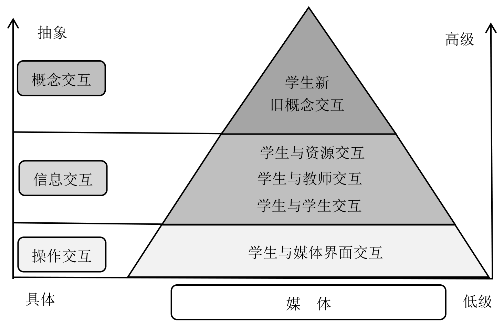

**图1　教学交互的三个层次（操作—信息—概念）**
同一层次也可用阶梯形自绘图呈现，便于教研时快速判断“这节课停在哪一层”。

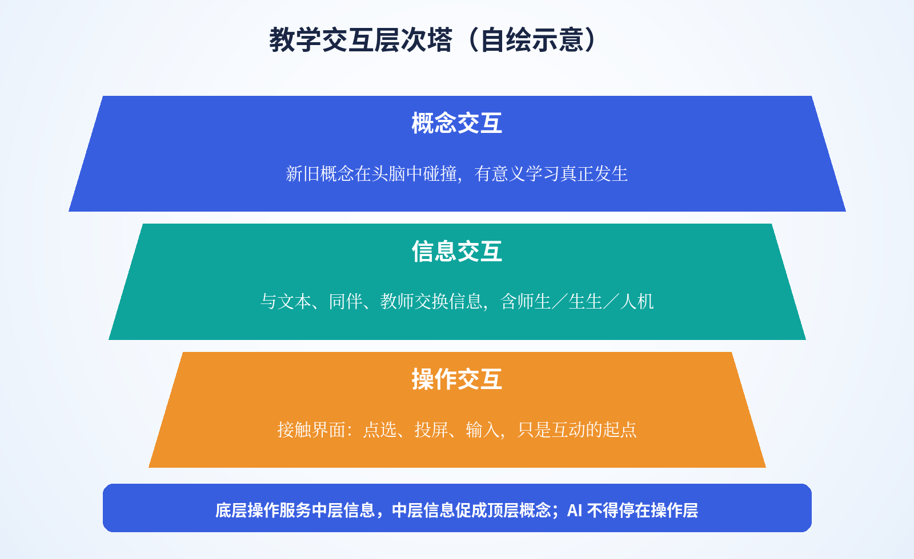

**图2　教学交互层次塔（自绘示意）**
互动层次还可与认知发展水平相互映照：分析、评价、创造等高阶思维，主要发生在信息交互向概念交互跃迁的区间。

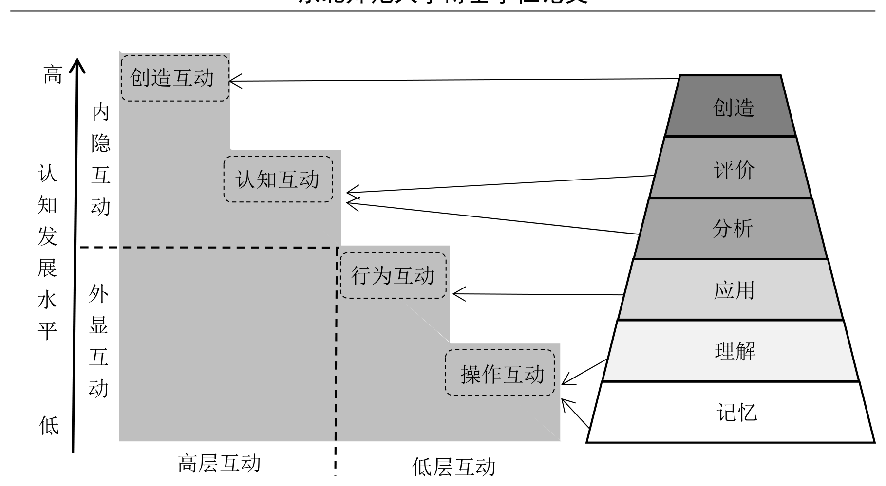

**图3　互动类型与认知发展水平的对应关系**
正是在这一尺度下，小学语文AI数字化课堂的持续观察显示出一种刺目的落差：工具进了教室，互动却未必升级。下文按“是什么—怎么样—结果呢”展开，把失衡写具体，把校准写成阶，把均衡写成可检验的结果。

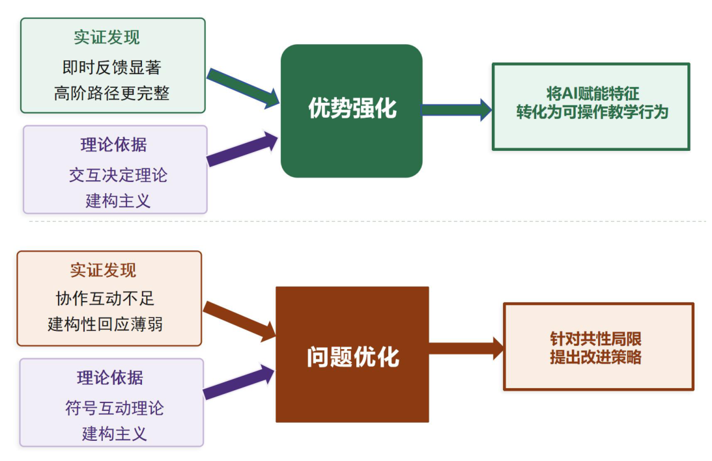

**图4　由实证发现与理论依据走向优势强化、问题优化的研究逻辑**

## 一、审视——三元协同课堂互动失衡之困
困境聚焦。问题不在“有没有用AI”，而在“谁、在什么场景、缺什么、缺到什么程度”。四类异化互动——程式化、主客化、垄断化、工具化——并非并列散落，而是沿“形式—关系—技术”层层加码：形式单调使参与面变窄，参与面变窄使内容趋于片面，内容片面使思维停在浅层，浅层互动又强化教师单向输出；AI介入后，这套旧病被更流畅的界面包装起来，出现以人机问答冒充心灵交往的新误区。

### （一）形式困局：程式问答，遮蔽深度互动之面
问题透视。形式困局的病灶，是把互动窄化为“教师一呼、学生百应”的放射状问答，多向通道尚未打开，深度互动被流程遮蔽。

#### 1. 现象扫描：一呼百应，难开多向通道
走进统编教材三年级下册寓言阅读课，常见场景是：教师站在投影中央抛出“这个故事告诉我们什么道理”，全班齐答“不能心存侥幸”，个别优等生补充一句“要靠劳动”，教师点头进入下一环节。教师与全体、教师与个别两条通道占满整节课，教师与小组、生生、组际的多向互动严重缺乏。AI若直接投出“标准寓意”，学生跳过涵泳与试错，程式被包装得更流畅，深度互动反而被遮蔽。一呼百应的齐声，往往意味着主体并不在场。

#### 2. 程度刻画：三分沉默，难破主导课型
对小学AI数字化课堂的持续观察显示，“教师主导型”课型仍占相当比例。秧田式座位、教师独占讲台，对应的是身体在场、发言通道单向。典型课例中，近三分之一学生可能整节课沉默——不是“不会”，而是没有进入对话的通道。小学生面对同伴本更敢提问、敢纠错，多数课堂却压缩合作探究。AI本可归集不同想法，不少教师却只把它当作习题训练与投屏工具，技术在场，通道仍旧只有一条。

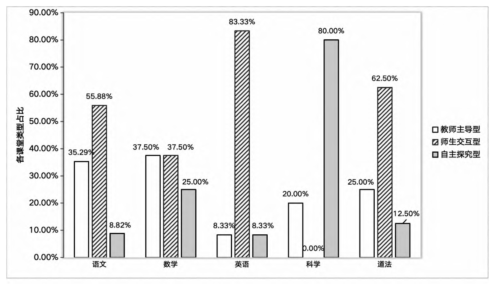

**图5　小学AI数字化课堂的课型分布**
秧田式座位和统一的注意朝向，是教师主导型课堂最直观的空间表征。

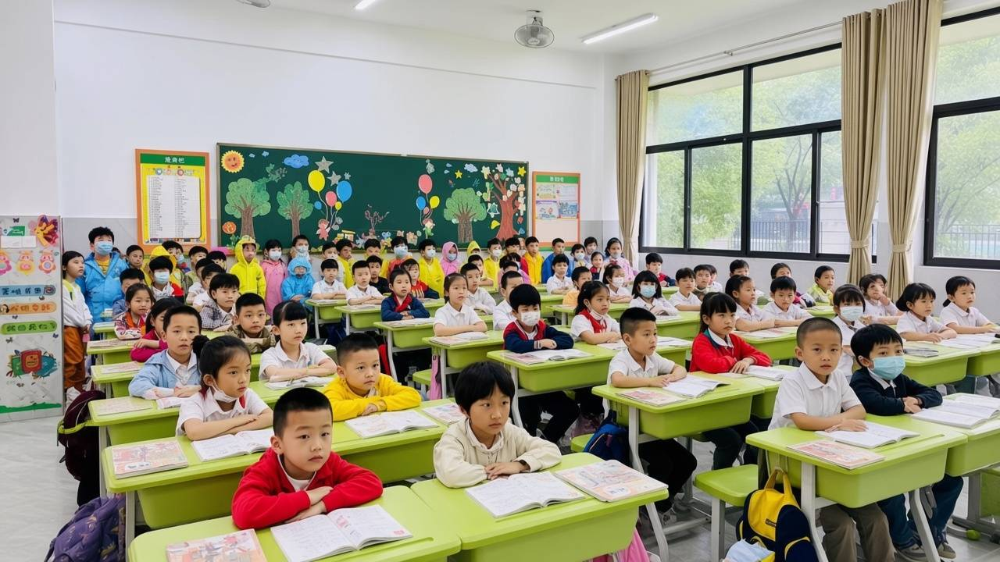

**图6　教师主导型课堂的座位与注意朝向（场景示意）**
对话行为的连接路径也呈教师中心的放射状，学生之间缺少横向追问与回应。

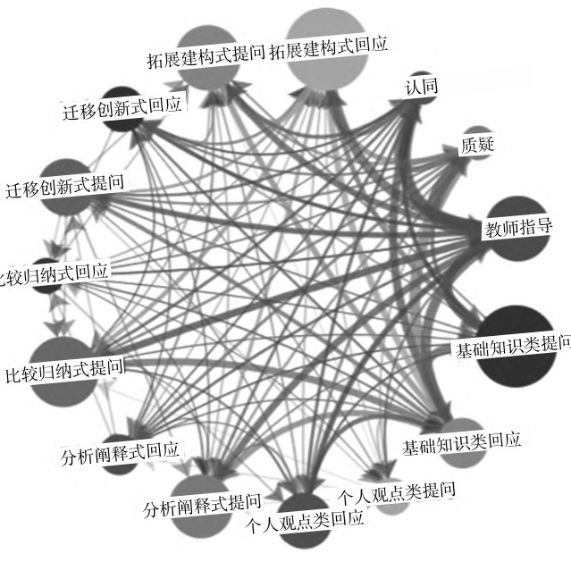

**图7　典型课堂的互动行为路径**

#### 3. 原因探寻：教案固化，难放探究时间
症结剖析。教师担心小组活动打乱节奏、耽误知识点落实，于是把问答流程写进教案的每一分钟：先问什么、谁来答、标准句是哪一句，全预置完毕。课堂追求永远的平衡与有序，容不得“失衡后的再平衡”。一旦教案被执行完毕，互动就被宣告完成。形式困局看起来是“问法单一”，根子却是不敢把时间交给不确定的对话。

### （二）关系困局：主客垄断，消解平等交往之面
问题透视。完整互动包含认知互动、情意互动和行为互动。关系困局的病灶，是教师在认知、伦理上始终居优势，发言为少数人所独享，平等交往名存实亡。

#### 1. 现象扫描：师发生从，难见情意往来
教师永远是发起者，学生只是执行者：问点落在字词句篇的标准解释上，学生出错时急于纠正答案，缺少情绪安抚，更舍不得把时间交给学生展示个性化的态度与学习方式。情感态度成为认知的附属。部分教师把AI当作强化自身输出的扩音器——同一段赏析，过去写在教案里，现在由机器读出来，主客关系不仅没有松动，反而被“更正确的声音”加固。学生的疑问难以转化为教学资源：与预设不合的想法，常被一句“我们下课再聊”绕开。

#### 2. 程度刻画：少数独言，难破旁听格局
垄断化交往与主客化关系缠在一起。课堂发言集中于少数表达流畅、被教师熟悉的学生；小组合作中常见“一人说、众人听”，内向学生与学困生长期处于边缘。互动大多在浅层次进行：没有深层次探究，没有思维碰撞，没有矛盾的激化，也缺少情绪的激动。课堂像一条单线条的溪流往前走，而没有潮起潮落。传统课堂往往在低阶行为之间循环；发言机会的不均等，使“全员互动”停留在口号。AI若只把“活跃者”的答案投上屏幕，边缘学生被看见的机会不会自动增加。
与之相对的应然状态，是学生面向同伴表达，教师退到一侧倾听，屏幕仅承担支架功能。

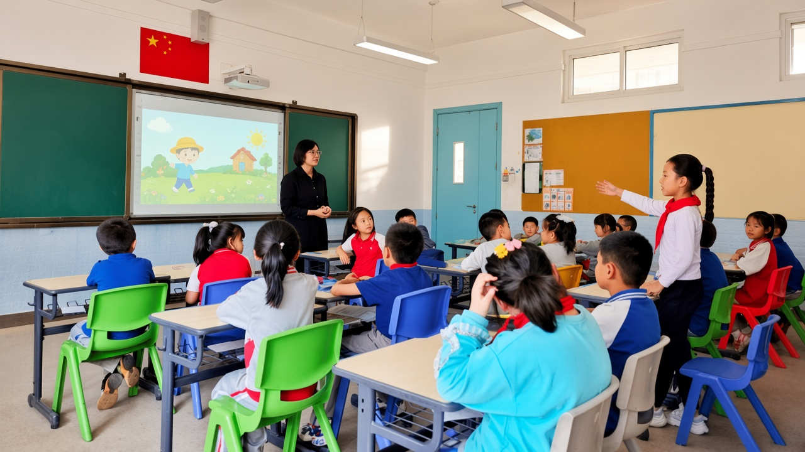

**图8　学生表达、同伴倾听的多向互动现场（场景示意）**

#### 3. 原因探寻：权威惯性，难改进度导向
原因探寻。教师固守“唯一正确声音”的身份，把师生互动等同于课堂提问，没有把交往看作教学的本质。评价层面，学校仍优先考量教学进度、知识点落实等可量化指标，教师担心开放探究耽误课时，不敢放开课堂。学生层面，倾听、表达、反思、合作缺少常态化训练，即便给了机会，也难以开展高质量对话。关系困局因此成为“教师不敢放、学生不会接、评价不支持”的叠加态。
不同互动行为与学习风格之间存在强弱不等的交互效应，这正是“一刀切”设计难以覆盖全体学生的原因。

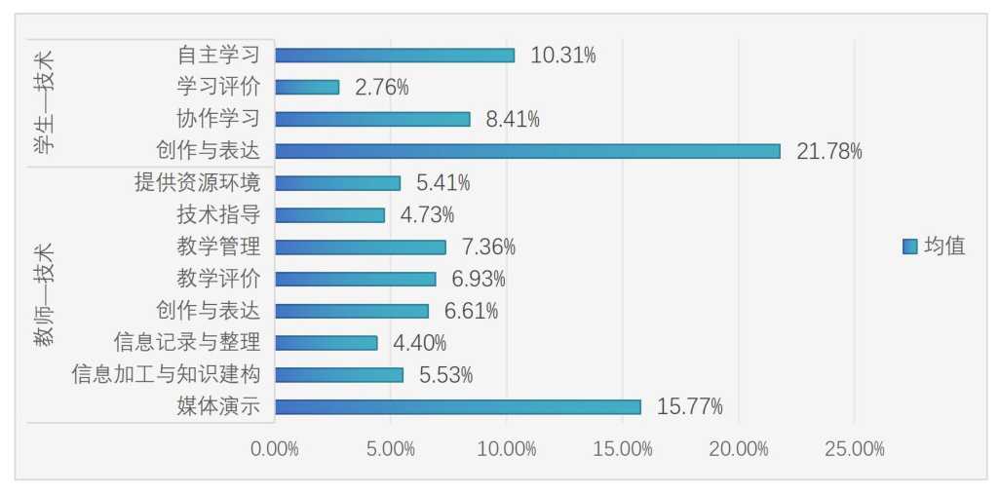

**图9　师生互动行为与学习风格的交互效应**

### （三）技术困局：工具越位，冒充心灵对话之面
问题透视。技术困局不是“用了AI”，而是AI从支架变成新的特权者：替学生思考，替教师判断，用人机问答冒充师生之间的心灵交往。

#### 1. 现象扫描：人机代言，难辨真假交往
AI介入课堂衍生出四种错位用法：一是“替答”，让AI直接输出结论，学生跳过探究与试错；二是“替评”，用机器评分、活跃度统计代替教师的情感回应；三是“替演”，以人机问答充当师生交往；四是“替证”，把是否使用AI当作课堂先进的证明。四者的共同点，是把“用了AI”当成交往已经发生的证据。课堂上可见的热闹是：学生对着屏幕读出标准赏析，教师点头，进入下一题。主体看似都在场，情境却不真实，过程更无生成。

#### 2. 程度刻画：替答替评，难越操作表层
人与技术的互动若引导不当，会高度集中于媒体演示、即时检索等操作层面，用于创作、表达、质疑的互动明显偏少。AI课堂的高阶互动占比虽有数字上的上升，但若只把AI当作“问答机”与“投屏器”，升上来的仍只是操作交互与信息交互，并未抵达概念交互，更谈不上情意共鸣。机器可以提示对错，却读不懂一个孩子为什么突然不说话；活跃度低可能是性格原因、准备不足或问题过难，一个数字代替不了现场研判。

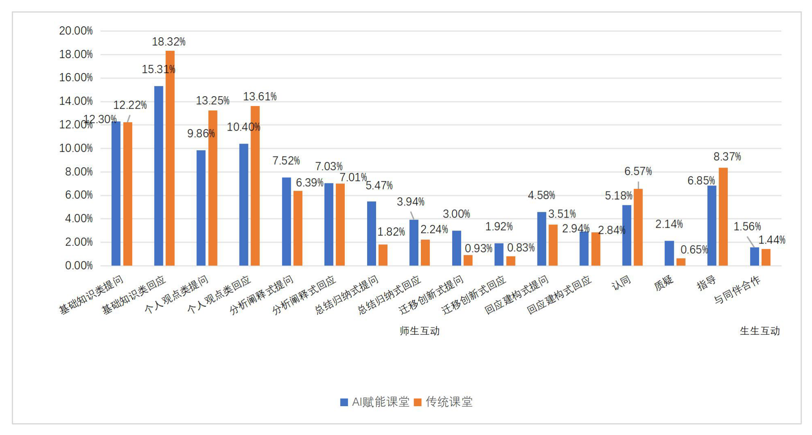

**图10　AI赋能课堂与传统课堂人际互动类型的分布对比**

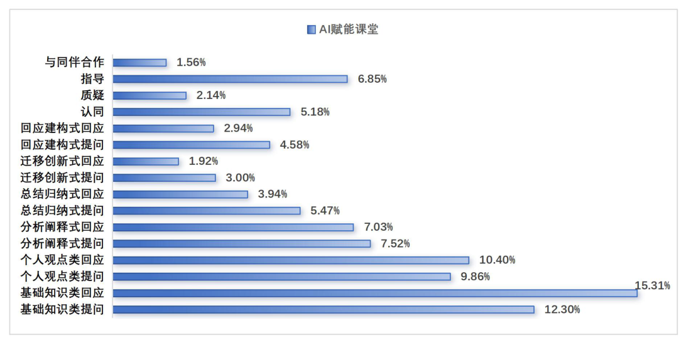

**图11　AI赋能课堂人际互动类型的构成**
从人机互动任务分布看，AI课堂在创作表达、协作学习等方面已有增量，但媒体演示仍占较高比例，说明“技术在场”尚不能等同于“概念交互发生”。

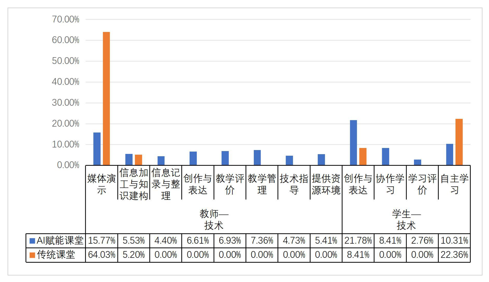

**图12　传统课堂与AI赋能课堂人机互动类型的分布对比**

**图13　AI赋能课堂人机互动类型的构成**

#### 3. 原因探寻：以用代证，难守育人尺度
原因探寻。一部分教师对AI认知不足，不敢尝试；一部分青年教师过度依赖生成内容，缺少人机协同的教学设计能力，不能平衡工具与育人目标。数字化课堂评价容易聚焦“工具是否出场”，忽略情感交往、思维成长等质性指标。权责边界一旦模糊，AI就会从支架变成课堂里新的特权者。底线其实清楚：情感体察与价值判断必须由人完成。做不到这一点，三元协同只是多了一块屏幕的二元课堂。
三类困局对照如下。后文三条策略与此一一对应，并按“先破形式、再复权责、后守边界”拾级而上。

**表1　三类困局、识别信号与校准指向**

| 困局 | 谁、在何场景、缺什么 | 缺到什么程度 | 校准指向 |
| --- | --- | --- | --- |
| 形式困局 | 寓言、识字等常态课中，师生缺多向通道与生成空间 | 近三分之一学生整节课沉默，教师主导型课型仍占相当比例 | 破程之阶：打开通道 |
| 关系困局 | 教师与内向生、学困生之间，缺平等发起权与情意回应 | 小组“一人说、众人听”，情意互动沦为认知附属 | 复权之阶：校准主客 |
| 技术困局 | 教师、学生与AI之间，缺不可越位的权责边界 | 替答、替评、替演、替证并存，交互停在操作表层 | 守界之阶：限制越位 |

## 二、探究——三元协同课堂互动校准之阶
实践探索。新的教学观认为，教师是“平等中的首席”。针对形式、关系、技术三类困局，策略不宜再作六点并列铺陈，而应抓住“怎样互动、谁与谁互动、为何互动”三个追问，走由外而内的三级台阶：先破程式、打开通道，再复权责、还发言于全员，后守边界、把技术按回支架。三阶不是同级并列，而是必须拾级而上——通道不开，权责校准会变成新的点名游戏；权责不校准，守界只会停在口头提醒；边界不守，前两阶都会被“更流畅的标准答案”吞掉。三条路径共用一条准绳：从操作交互拾级而上，经信息交互抵达概念交互，并守住情意共鸣。课前先用一分钟诊断“这节课卡在哪一层”，再决定人机分工，课后用观察简表验证是否进入概念交互。策略应用采取“观点阐述＋步骤工具＋案例举隅”的方式，课例均来自统编教材常态课。

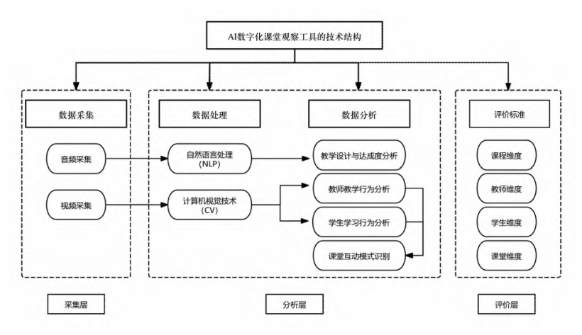

**图14　三元协同下课堂互动优化的三条实践路径**
三条路径共同指向由操作层向信息层、概念层和情意层逐级上行。

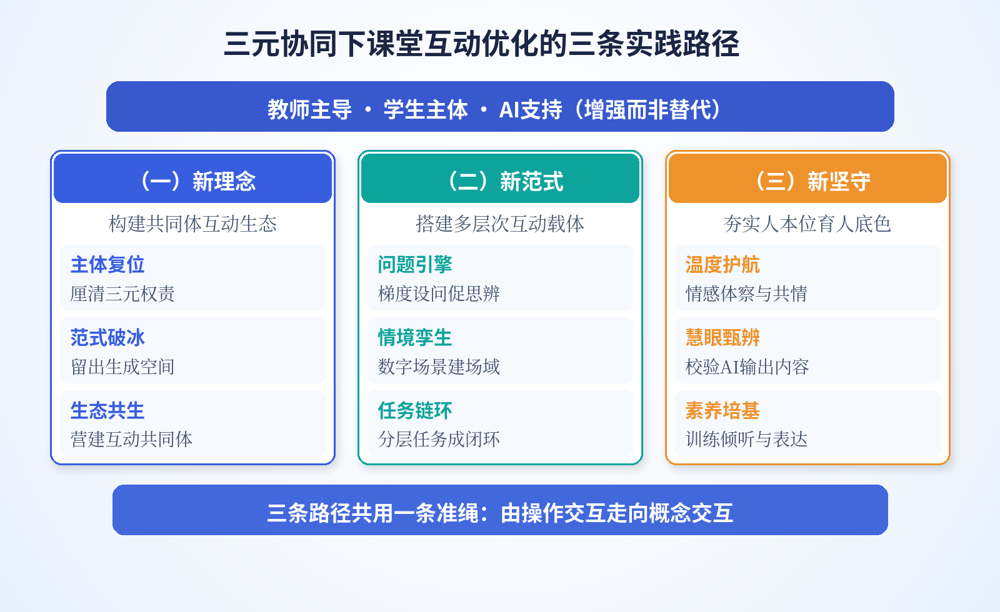

**图15　从操作交互走向概念交互与情意共鸣**
三元协同并不等于三方平均用力，而是各守其位。低年段学生操作能力有限，AI的使用更多由教师发起；中高年段逐步把提问权、校验权交给学生，教师更多承担“问题守门人”与“价值把关人”。边界随学段调整，底线不变。

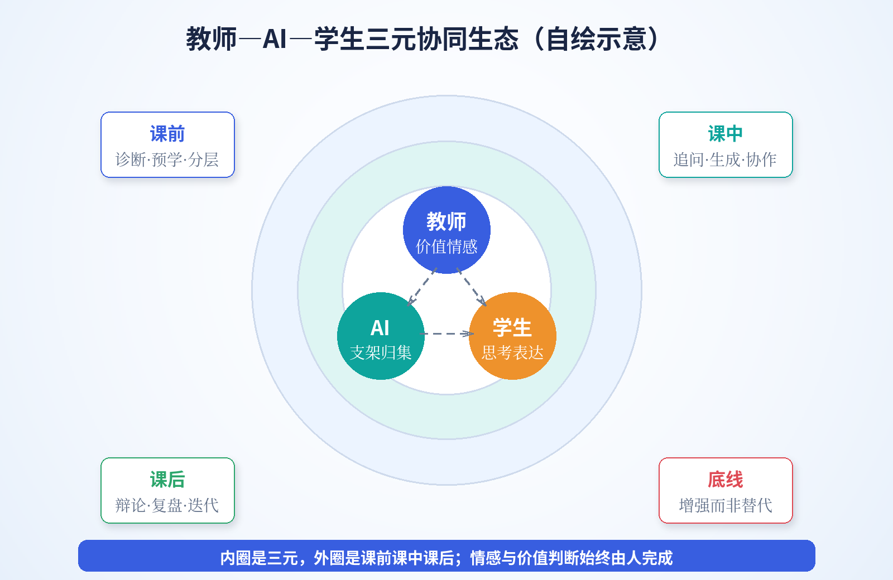

**图16　教师—AI—学生三元协同生态（自绘示意）**
在具体课堂中，操作、行为、认知与创造并非割裂层级，而是由资源支架、师生对话和协作任务连接起来的连续结构。

**图17　课堂互动层次及其与思维发展的对应关系**

**表2　“教师—AI—学生”课堂互动权责简表**

| 主体 | 主要权责 | 不可越位之处 |
| --- | --- | --- |
| 教师 | 目标设计、价值引领、情感沟通、即时调控、甄别AI内容 | 不把育人判断交给算法 |
| AI | 素材与情境生成、学情归集、观点汇总、分层任务分发 | 不直接给出本应由学生完成的终答 |
| 学生 | 自主探究、同伴协作、有效提问、校验信息、真实表达 | 不照搬AI语句代替自己的思考 |

### （一）破程之阶：打开通道，让问答走向多向
行动实施。对应形式困局：要把“教师一呼、学生百应”的单通道，改成可选择、可生成、可延伸的多向通道。本阶不先谈理念口号，而先改问题、改生成、改任务——通道一开，程式才松动。

#### 1. 问题引擎：梯度设问，先思后比起于终答
方法尝试。减少“是不是、对不对”的封闭式问题，改用粗线条、有包容性的发散问题：让学生做策略与思路的选择，而不仅仅选择某一个操作步骤。AI可用于生成问题梯度，但须限定——只提供问题与材料线索，不输出最终赏析。操作上分四步：第一步，教师确定本课核心概念（如“动态变化中的观察与想象”）；第二步，请AI按由易到难生成四层问题，教师做守门人，删掉“标准答案型”设问；第三步，学生先独立写关键词、同桌互说，再全班比读课文；第四步，AI的“标准描写”先折叠，学生写完再打开，作对比而不作范本。

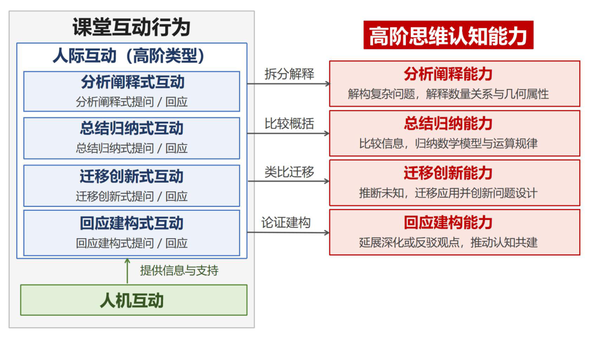

**图18　课堂互动行为与高阶思维认知能力的对应关系**

**【案例举隅1】三年级下册《火烧云》：先观察表达，后让AI供问**
课前布置学生观察晚霞，写下三句“我的火烧云”。课中请AI按“颜色变化—形状联想—动态用词—情感余味”生成四层问题，教师筛选后投屏。规则写在黑板角落：AI的问题可以借用，AI的“标准描写”先不看。表达较弱的学生抓住颜色词就能开口，表达较强的学生可以讨论动态与想象。梯度问题把互动从“猜老师要的答案”拉向“我能说一层、再进一层”。AI是问题引擎，教师是问题守门人，学生才是意义的建构者。若一上课就投出“标准美文”，通道瞬间重新闭合。

#### 2. 生成接住：偏差入课，意外疑问化为资源
教学实践。优质课堂不是永远按教案机械执行，而是预设与生成的辩证统一。备课宜粗备框架、细留空间：课前用AI生成多套问题链与备选语料；课中一旦出现教案之外的问题，调用AI获取多角度参考，但不直接宣读答案，而把它变成研讨引子。关键动作只有一个——接住，而不是绕开。接住的标志是：把学生的那句话写上黑板，追问“课文里有没有依据”，再决定要不要调用AI补充材料。

**【案例举隅2】三年级下册《守株待兔》：一句“也许他只是太累了”**
课堂上，一名学生提出：“守株人也许只是太累了，想歇一歇。”这显然偏离教案预设。教师没有急于纠偏，而是顺势追问：“课文里有没有写他累？如果没有，你觉得作者为什么要把这个故事写得这么夸张？”随后调用AI补充“寓言中的夸张手法”与“生活中的侥幸心理”两类材料，组织正反两方用课文语句说话，最后回到“故事的结局说明了什么”。生成的偏差被转化为教学资源：教师没有否定学生，也没有让AI给终答，而是把讨论拉回文本证据。若选择绕开，学生很快会学会只回答教师期待的话；生成被接住，互动才从执行教案走向真实的思维碰撞。

#### 3. 任务链环：分层驱动，预学互学辩学闭环
策略践行。通道不仅要在课中打开，还要沿时间轴拉长，避免“课上热闹、课后断开”。低年级适宜同桌两人合作：互说思考过程、互查、互提问题；高年级适宜多人小组，兼顾组际、教师与小组、小组对个人的多条影响通道。利用AI完成任务分发与观点归集，形成“课前预学—课中互学—课后辩学”闭环。工具进课堂也要有流程：先明确任务，再决定何时调用AI、何时必须回到文本与同伴。

**图19　课堂中人工智能应答与数据回传的使用流程**

**【案例举隅3】四年级下册《我们家的男子汉》：三层任务与“我与AI辩论”**
围绕“课文怎样写出一个孩子的成长味道”，设置三层任务：A层找出写“男子汉”言行的句子并朗读；B层小组讨论作者为什么用这一称呼；C层尝试用一段话写“我们家的——”。AI按层次推送提示卡（不含现成赏析）。课中汇集A层朗读与B层关键词，教师组织倾听与追问。课后布置“我与AI辩论”：学生先写约100字感受，再请AI写一段同题文字，用红笔标出“我同意／我不同意／课文里有证据吗”，第二天用一句话交流。分层不等于降低要求：A层同样要被追问“为什么这样读”，C层同样要接受同伴评议。任务链让互动纵向延到课前课后，横向覆盖不同能力的学生，放射状单通道才真正被拆开。
低年段打开通道，不宜一上来就“人机辩论”，而宜用情境降低开口门槛，同时防止画面抢走识字主干。工具步骤是：先定本课字族与要说的一句话；再请AI生成一幅连贯情境图，教师检查是否出现错别字、是否偏离生活经验；然后指图说词、同桌互考、口头运用；最后收掉画面，只留汉字，看学生能不能靠偏旁和生活经验把字分开。一年级下册识字3《小青蛙》，教师用AI生成“小青蛙在清清的河边看晴天”的连贯情境图，把“青、清、晴、情、请”放进同一幅画。识字仍按“知其音、识其形、明其义”推进。图画是帮手，不是课堂的主角。判断情境是否用得好，标准只有一个：学生是否因此更愿意读、更敢于说。看动画、少识字，就是通道打开失败。

### （二）复权之阶：校准主客，让发言走向全员
策略应用。对应关系困局：通道打开之后，若权责仍旧“师发生从”，多向互动会迅速被少数学生重新垄断。本阶要做的，是把发起权、可见权、提问权从教师和“能说的学生”手里校准回来。

#### 1. 角色校准：三元归位，人守判断机守支架
实践探索。教师首先放下“唯一正确声音”，确立交往为本：AI的定位是支架，处理可重复、可统计的事务，不可替代心灵交往；学生是互动主体，既向AI提问，也要辨别、质疑AI的输出。课堂上是否真正复位，只看两个瞬间：当学生说出与预设不同的答案时，教师是接住还是绕开；当AI给出看似标准的解读时，教师是宣读还是追问。

**【案例举隅4】三年级下册《守株待兔》：AI扮角色，教师守寓意**
课中不急于揭示“不可心存侥幸”，先请学生用自己的话说故事，把“宋人为什么会被人笑话”作为悬念留住。随后请AI扮演“守株人”，用第一人称辩解：“我不过是等一个机会，机会来了为什么不抓住？”学生分组向“守株人”追问：庄稼谁来种？兔子会再来吗？邻人会怎么看？AI只负责把各组问题归类投屏，教师抓住“侥幸—劳动—事理”组织班级对话，最后点明寓言的现实指向，并提醒：AI可以“变成”故事里的人物，却不能替我们判断对错。若一开始就让AI输出寓意，学生只需记录结论，主客关系立刻复辟。此处AI承担角色陪练与问题归集，教师承担价值判断，学生承担质疑与表达。AI的“辩解”越像样，学生越需要回到课文找证据，这恰恰是深度互动的契机。

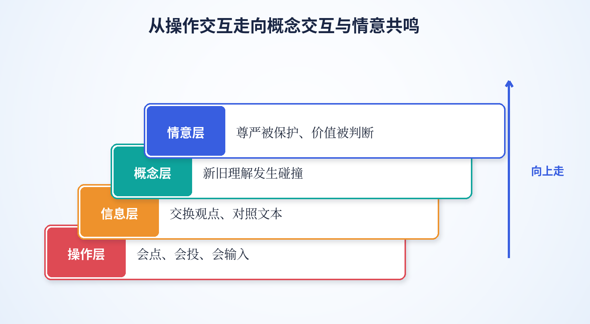

**图20　学生主动表达、教师组织追问的互动现场（场景示意）**

#### 2. 全员可见：观点上屏，边缘声音进入对话
教学实践。垄断化交往的破解，不是多点几个名字，而是让每一个想法被看见。AI把小组观点可视化，帮助内向学生进入公共屏幕；教师组织互评、追问与归纳。投屏不是展览，而是下一次对话的起点。教师应追问：“哪一组的说法和课文最贴近？还有谁想补充或反驳？”技术支架一旦连上人际对话，共同体才运转起来。

**【案例举隅5】五年级下册《手指》：让每个组的想法都出现在屏幕上**
小组合作学习“五根手指各有什么特点”后，各组把关键词输入学习平台，AI按“姿态、作用、性格”三类自动归集并投屏。教师不评价哪一组更好，而是先请一组说明“为什么把它归在性格一类”，再请另一组补充或反驳，最后请全班为五个关键词找出课文中的依据。过去只有少数学生的答案会出现在黑板上，现在每一组的关键词都会进入屏幕，学生因此更愿意投入讨论。AI完成归集与呈现这类可重复工作，教师腾出精力处理观点冲突。这是“增强而非替代”在座位上的样子：小组围坐，教师蹲下来听，屏幕只呈现归集结果。

**图21　小组协作中教师倾听、技术仅作支架（场景示意）**

#### 3. 提问复位：下放问权，学生追问成为常态
方法尝试。主客化关系的深层结构，是提问权始终在教师手里。复权的第三步，是把“问”教给学生，并规定：向AI提问，不得直接索要终答。课前用一节微型课训练句式，把句式贴在语文书首页，课后据此提问，并把AI的回答与课文对照。

**表3　学生向AI提问的支架句式**

| 使用场合 | 不建议这样问 | 建议这样问 |
| --- | --- | --- |
| 预习阶段 | “这篇课文讲了什么？” | “课文中哪几处写到了××？分别在第几段？” |
| 阅读探究 | “帮我分析这句话的作用。” | “这句话如果删掉，意思会有什么不同？” |
| 表达交流 | “帮我写一段关于××的话。” | “我的这段文字，哪里写得还不够清楚？” |
| 校验信息 | “你说得对吗？” | “你的依据在课文哪一句？我能不能找到反例？” |

**【案例举隅6】四年级下册《我们家的男子汉》：把提问方法教给学生**
在“我与AI辩论”任务前，教师用一节课把“帮我写一段”改成“课文中哪些句子写出了他的成长”“我的这段文字和课文比，少了什么”。学生带着自己的问题走向机器，而不是带着空白等待被填满。提问权下放之后，教师从“唯一提问者”变成“问题质量的教练”，主客关系才发生结构性松动。为防止“下放”变成放任，课中设三道闸：第一道，学生提问须先指向课文某段某句；第二道，AI回答必须当众被追问“依据在哪”；第三道，每组至少有一名“沉默观察员”负责记录谁还没说话，下一次优先把话筒递过去。全员不是平均发言秒数，而是没有人被固定排除在对话之外。

### （三）守界之阶：限制越位，让技术回归支架
策略践行。对应技术困局：通道有了，权责明了，若没有不可逾越的边界，AI仍会以更精致的方式“替答、替评、替演、替证”。如果说破程之阶解决“想怎么互动”、复权之阶解决“谁来互动”，守界之阶解决的是“什么不能交给机器”。

#### 1. 温度护航：出错先护，评分课后单独回看
行动实施。教师要察言观色，发现学生受挫、紧张、突然不说话的瞬间。学生读错、说错时，先保护自尊心，再引导回到文本。AI可以提示对错，却读不懂一个孩子为什么低下头。操作约定三条：当众不展示带羞辱性的机器分数；先问“你刚才看到了什么／想到了什么”，再范读或同伴带读；分数与等级留到课后单独查看，并与下一次进步对照，而不是与全班排名对照。

**【案例举隅7】三年级下册《火烧云》：不让机器评分当众挫败学生**
朗读展示环节，一名学生把课文中的比喻读破了句子，语音测评给出较低分数。教师没有展示分数，而是先问：“你刚才看到了什么颜色？”肯定他的观察，再请他跟着范读一遍，最后让他自己挑一句最喜欢的读给同桌听。分数留到课后单独查看。这一处理看似只是“不公布分数”，实则守住互动底色：一旦机器评价当众生效，学生下次会更倾向于选择安全的答案。温度护航，就是不让技术评价成为当众挫败的来源。

**图22　出错之后先保护自尊，再回到课文（场景示意）**

#### 2. 慧眼甄辨：据文校验，机器改写当场证伪
教学实践。教师既是互动的一方，也是互动的调控者。对AI生成的释义、赏析、学情标签尤须审慎：活跃度低不能直接等同于“不认真”。课堂互动评价要从操作、行为、认知到情意逐层观察，避免把“发言次数”当作质量的唯一尺度。更关键的示范是：当着学生的面质疑AI，用课文证伪“很会说话”的句子。

**【案例举隅8】三年级下册《守株待兔》：用文本证据否定AI的“正能量改写”**
课后拓展时，有生成式工具把寓言解读为“等待也是一种策略，机会总是留给有准备的人”。教师没有直接否定，而是把这句话投在屏幕上，请学生回到课文找依据：庄稼完了没有？邻居怎么说？宋人最后的结果是什么？学生很快发现，文本里没有任何一处支持这种解读。教师小结：AI很会说话，但它不一定读过这篇课文；读书的人，要学会自己判断。当学生看到教师当场质疑AI，“机器说的就是对的”这一默认印象就会松动，思维互动随之进入概念交互。

#### 3. 素养培基：教给问法，对照课文养成质疑
实践探索。学生的倾听、表达、反省习惯不建立，任何精巧的人机设计都会落空。AI时代还须加上媒介素养与思辨质疑，并用任务驱动，避免停留在口号。培基四件事要进常态：建立发言与倾听规则；教会向AI有效提问（见表3）；养成“先找课文、再看机器”的校验习惯；以“我与AI辩论”等小任务做实践，让质疑可看见、可批改。

**【案例举隅9】提问句式进书本，辩论任务进课后**
把表3的句式作为单元常规，而不是某一课的点缀。学生在预习、探究、表达、校验四个场合反复使用同一套问法，互动质量才不依赖某一节“公开课状态”。素养培基看起来“慢”，却是三元协同不滑坡的根基：学生会问、会听、会证伪，AI才不会重新越位。守界要写成课前可张贴的三条铁律，避免只存在于教师心里：铁律一，AI可以给问题、给材料、给归集，不可以给本课终答；铁律二，机器评分可以课后看，不可以当众惩；铁律三，任何AI句子上屏，都必须经过“课文里有没有依据”这一问。三条铁律对着三类错位：替答、替评、替证。替演则靠角色扮演的权责切割来限制——AI可以扮“守株人”，不可以扮“真理的化身”。
九个课例的三元分工与升级点，可收束为一张对照表，供教研时按课取用。

**表4　九个课例的三元分工与互动升级点**

| 课例 | 主要互动设计 | AI承担 | 互动升级点 |
| --- | --- | --- | --- |
| 《守株待兔》 | AI扮角色，学生追问 | 角色辩解、问题归类 | 由听讲转向质疑与论证 |
| 《守株待兔》二 | 接住意外疑问，正反辨析 | 补充两类材料 | 由执行教案转向生成 |
| 《守株待兔》三 | 用文本证据质疑AI | 生成争议性解读 | 由接受结论转向批判思维 |
| 《手指》 | 小组关键词归集投屏 | 归集与可视化 | 由少数发言转向全员表达 |
| 《火烧云》 | AI梯度设问，先写后比 | 生成问题梯度 | 由浅层应答转向多层表达 |
| 《火烧云》二 | 不当众展示机器评分 | 语音测评（课后查看） | 由评价驱动转向情感支持 |
| 《小青蛙》 | 情境图助识字 | 生成连贯情境图 | 由机械识记转向语境识字 |
| 《我们家的男子汉》 | 三层任务＋课后辩论 | 分层提示卡 | 由课中互动转向链环互动 |
| 《我们家的男子汉》二 | 提问句式训练 | 充当被提问对象 | 由随意提问转向有效提问 |
三阶合在一节常态课里，时间分配也要有层次：破程约占课中前段，用问题和任务把通道打开；复权贯穿中段，用归集、追问、下放问权避免重新垄断；守界放在出错、生成、结课等“容易越位”的节点上，用铁律把技术按回支架。没有前阶，后阶是空的；没有后阶，前阶会被机器终答一口吞掉。这才是“××之阶”而不是“××并列”。

## 三、反思——三元协同课堂互动均衡之效
结果反馈。校准是否有效，不能只看“这节课用了AI没有”，而要按“过去—现在—未来”三段审视：已经出现哪些可感知的均衡，眼下仍有哪些温差，下一步如何把策略变成可迭代的日常。

### （一）成效回望：参与拓宽，互动层次拾级而上
数据呈现。就已开展的课例实践与课堂观察而言，变化首先出现在“谁开口、开口到哪一层、开口之后有没有回路”。

#### 1. 覆盖之变：旁观者减，有效发言覆盖更广
过去，放射状问答使近三分之一学生整节课沉默，小组里“一人说、众人听”。现在，任务分层保证人人有事可做，观点归集使每一组关键词进入屏幕，“我与AI辩论”把表达权延到课后。观察中可见：内向学生不必第一时间当众成段发言，也可以经由小组输入被“看见”；有效发言次数与覆盖面同步上移。覆盖面的意义不在热闹，而在边缘学生不再固定缺席。

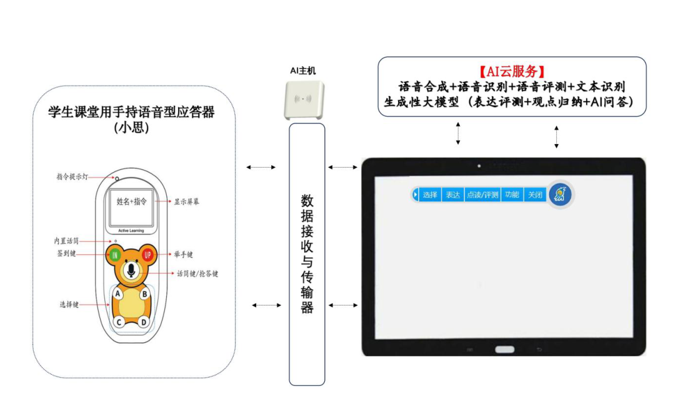

**图23　连续课例中有效发言次数的变化**
兴趣前后测也显示，互动通道拓宽后，“比较喜欢”的学生人数增加，“一般”与“不喜欢”的人数下降。

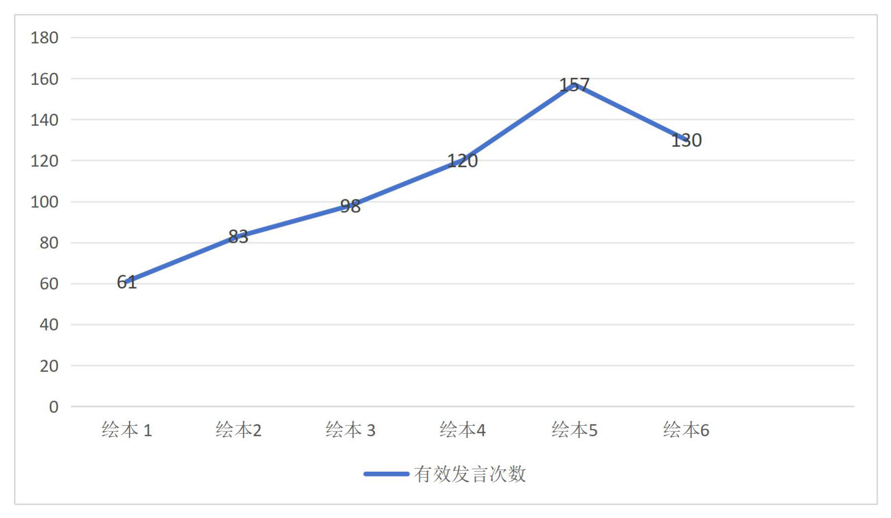

**图24　学生学习兴趣前后测对比**

#### 2. 层次之变：操作之上，概念交互开始发生
过去，互动在“找出关键词、齐答道理”的信息层循环。现在，《守株待兔》里学生用课文证伪AI的“正能量改写”，《火烧云》里先写后比而不把机器美文当范本，《手指》里为归类找出课文依据——这些行为落在“分析、评价、质疑”区间，是信息交互向概念交互的跃迁。课堂上开始出现教案之外的想法被接住、被讨论、被证伪或被吸收。层次上移，才是“用了AI”之外真正要看的结果。

#### 3. 关系之变：单向收敛，多回路结构初成形
过去只有“教师—全体”“教师—个别”两条通道。现在教师与小组、生生之间、组际之间乃至人机之间的通道同时工作，课堂行为模式由单一“提问—应答”回路，转向多主体、多回路。教师从“唯一正确声音”部分退到“平等中的首席”：守寓意、守温度、守证据，而把角色陪练、问题归集、梯度供问交给AI。关系均衡尚未完成，但方向已经从控制—服从，转向交往—共生。

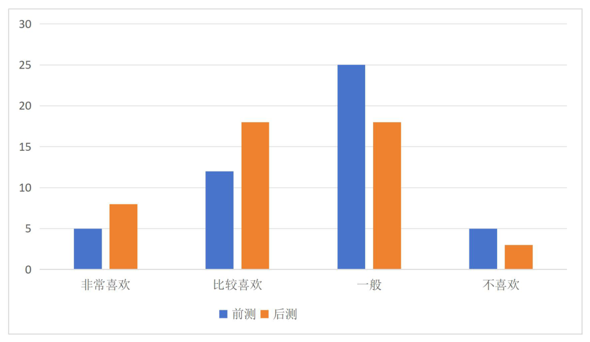

**图25　学生倾听、等待与回应的课堂现场（场景示意）**

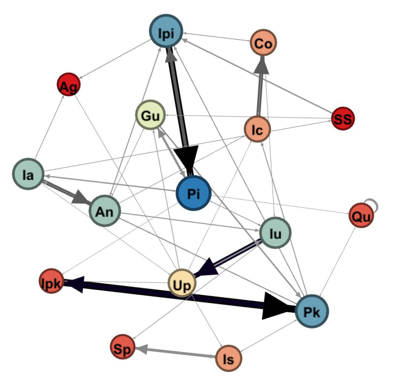

**图26　传统课堂教学行为网络**

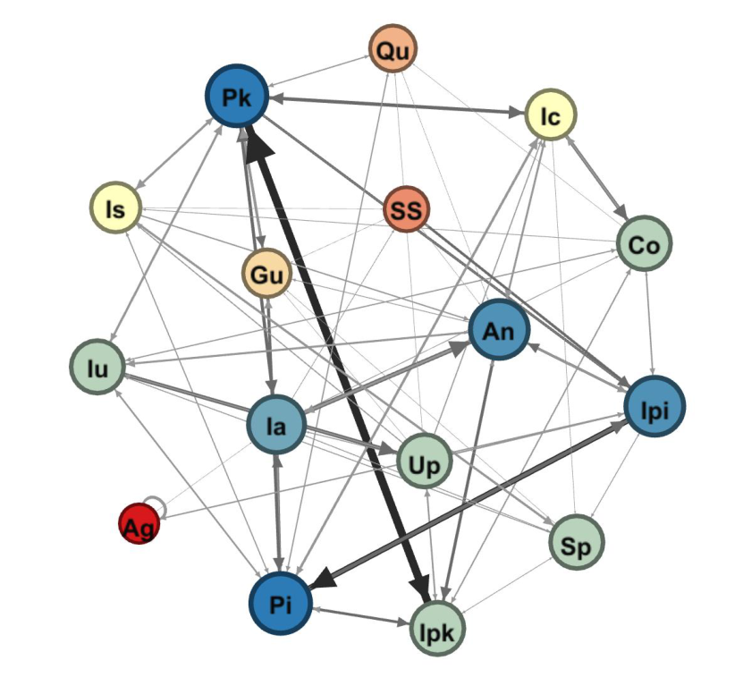

**图27　AI赋能课堂的多主体、多回路教学行为网络**

### （二）问题检视：技术惯性，情意回应尚有温差
成效总结。均衡是目标，不是已经完成的状态。眼下最需要诚实写下的，是三处仍未闭合的温差。

#### 1. 惯性犹在：给终答易，给支架难成习惯
公开课、研究课上，教师能守住“AI不给终答”；回到日常进度压力下，仍容易随手投出标准解读，以换取“这节课讲完了”。给支架比给终答更费时间：要筛选问题、折叠答案、组织比读。技术惯性与进度焦虑叠在一起，破程之阶就会回潮为更精致的程式化。这是现在时的第一问题。

#### 2. 素养落差：会操作易，会追问难成全员
学生会打开学习平台、会输入关键词，不等于会提出“这句话如果删掉会怎样”的问题。提问句式训练在实验班有效，但尚未变成年级常规；部分学生仍把AI当成“代写器”。倾听、反省、合作的能力落差，使全员可见停留在“屏幕上有名字”，尚未达到“每个人都能追问一句”。复权之阶在工具层走得快，在素养层走得慢。

#### 3. 评价滞后：看次数易，看情意难入量表
学校与教研评价仍习惯统计发言次数、工具出场、知识点覆盖。情意回应——学生出错时是否被保护、是否敢于再试一次——很难进量表，于是温度护航常被看成“教师风格”而非“必须达标的互动质量”。以用代证的评课习惯没有根除，守界之阶就缺少制度支持。数据可以提示“发生了什么”，不能代替教师判断“该不该这样互动”。

### （三）改进前瞻：课型适配，循证复盘持续生长
提升报告。面向未来，不需要再叠一套新口号，而要把已经有效的校准动作，做成不同课型可执行、每单元可复盘的日常。

#### 1. 课型分责：识写阅读，表达各守人机边界
下一步按课型写清人机分工，避免“所有课都用同一种AI”。识字写字重情境与即时反馈，阅读鉴赏重问题与可视思维，表达交流重互评与辩论，但终答、范写、价值判断一律留在人这边。

**表5　三类课型的人机分工建议**

| 课型 | AI的职责 | 教师的职责 | 学生的职责 |
| --- | --- | --- | --- |
| 识字写字 | 生成情境图与字形动画，提供笔顺与读音的即时反馈 | 组织书空、范写与组词说话，守住音、形、义的统一 | 指图说词、同桌互考，联系生活经验主动识字 |
| 阅读鉴赏 | 生成问题梯度与多版本资料，归集各组观点并可视化 | 做问题的守门人，组织追问与比读，强调用课文语句作证 | 先独立批注再合作讨论，用文本证据支撑观点 |
| 表达交流 | 提供提示卡与写作素材，汇总同伴互评意见（不给范文） | 组织互评与修改，关注表达背后的情感与真实体验 | 写—评—改循环推进，为同伴提出具体可行的建议 |
可与“课前预学—课中互学—课后辩学”衔接：课前AI协助分发预学任务，课中教师守问与守温，课后学生带着证据与机器辩论。环节可以灵活组合，但必须保留学生独立思考与真实表达的出口。

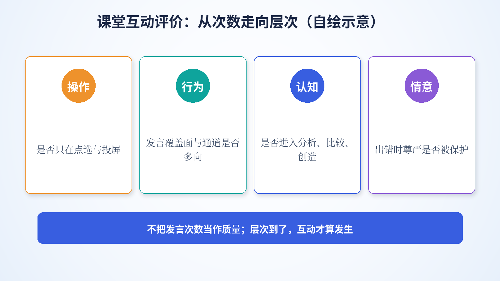

**图28　AI赋能绘本课堂的人机协同教学模式**

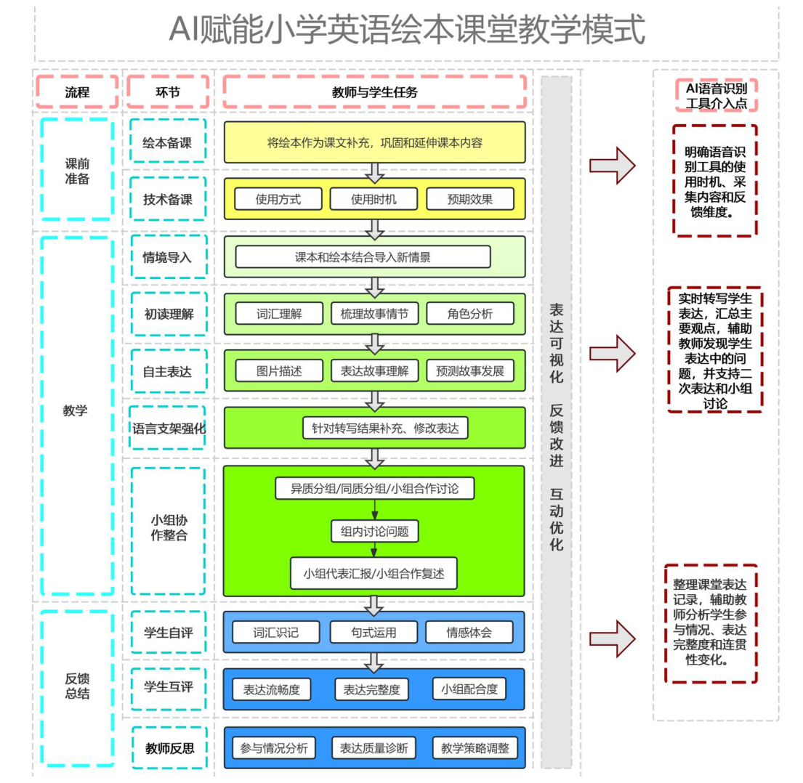

**图29　课前—课中—课后的三段式智慧课堂结构**
三个时段既要呈现教学流程，也要把AI、教师与学生的责任分别写实。

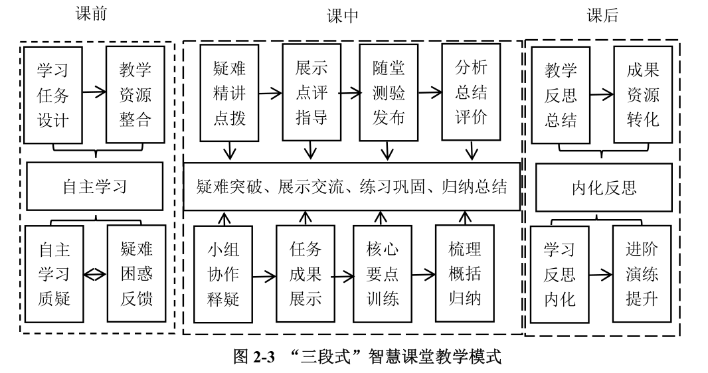

**图30　课前—课中—课后的人机分工**

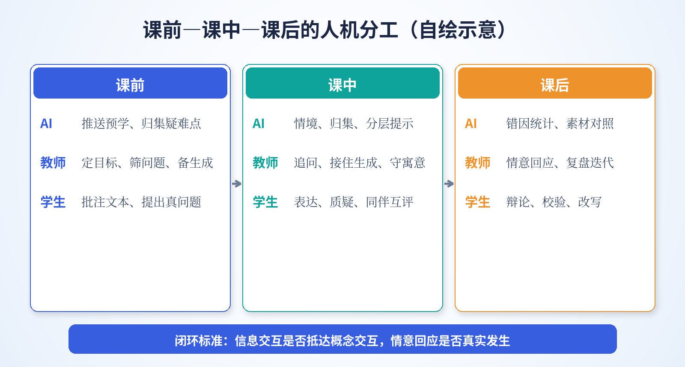

**图31　三元主体在课前、课中、课后的职责与闭环标准**

#### 2. 观察入表：覆盖层次，边界情意六维回看
把评课从“用了几个工具”转到六问：问题开不开放、参与覆盖到不到边、交互到没到概念层、人机有没有越界、情意有没有护住、倾听与质疑有没有发生。等级只作提醒，重点是发现哪些学生整节课没有进入对话。
观察工具可承担音视频采集、自然语言处理、课堂行为识别和数据汇总，但评价标准仍须覆盖课程、教师、学生与课堂四个维度。

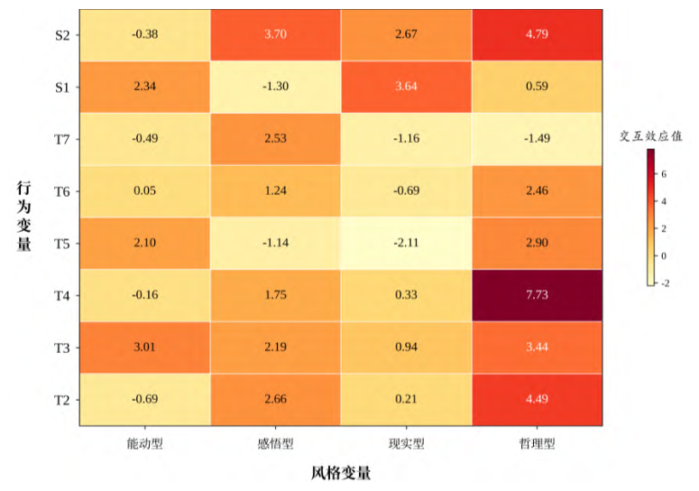

**图32　小学AI数字化课堂观察工具的技术结构**
复盘还可收束为“操作—行为—认知—情意”四问，防止只数发言次数。

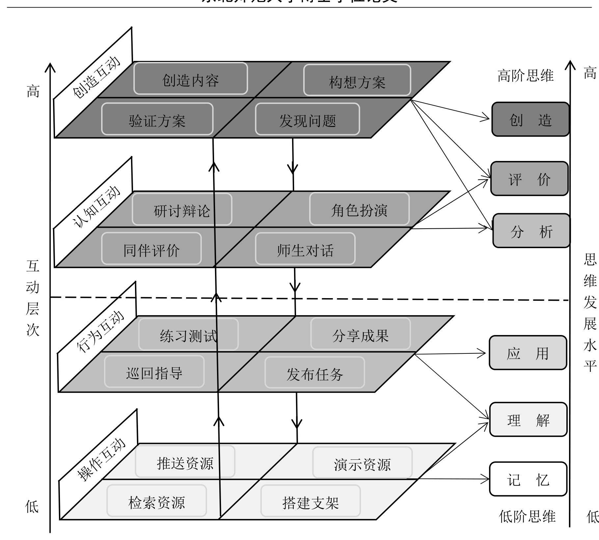

**图33　课堂互动评价四问（自绘示意）**

**表6　课中多向互动观察简表（供教师课后复盘）**

| 观察项目 | 观察要点 | 等级（优／良／待改进） |
| --- | --- | --- |
| 问题开放度 | 是否出现需要分析、比较、创造的发散性问题 |  |
| 参与覆盖面 | 发言是否超出少数固定学生，小组是否人人有任务 |  |
| 交互层次 | 是否从操作交互、信息交互进入概念交互 |  |
| 人机边界 | AI是否只提供支架，终答是否由学生完成 |  |
| 情意回应 | 学生受挫或出错时，教师是否保护自尊并继续对话 |  |
| 倾听与质疑 | 是否出现同伴追问、补充或对AI内容的校验 |  |

#### 3. 单元复盘：支架终答，对照表达循环迭代
策略要在一课一课的磨砺中生长。建议以单元为周期，用观察简表与课堂实录做循证复盘，专门比较“AI给终答”与“AI只给支架”两种设计下学生表达的差异，从而迭代问题链与任务链。复盘重点不是工具出场次数，而是信息交互是否抵达概念交互，情意回应是否真实发生。

**表7　课后循证复盘记录表**

| 复盘项目 | 记录要点 | 本轮发现 | 下轮改进 |
| --- | --- | --- | --- |
| 目标达成 | 本节课的核心问题是否被多数学生触及 |  |  |
| 参与结构 | 发言学生的分布，是否存在固定的“沉默群体” |  |  |
| 人机分工 | AI在哪些环节提供了支架，哪些环节反而替代了思考 |  |  |
| 情意回应 | 学生出错、受挫时教师的处理方式与效果 |  |  |
| 生成处理 | 课堂出现了哪些教案之外的生成，是否被接住 |  |  |
高质量的师生互动，不追求人机问答的表面热闹，而追求真实的思维碰撞与心灵对话。失衡，是三元进场后旧病与新误区叠在一起；校准，是破程、复权、守界拾级而上；均衡，是覆盖、层次、关系同时改善，并承认温差、把复盘做成习惯。只有理念、设计、情意与素养协同发力，“教师—AI—学生”才能成为智慧与人文共生的课堂生态，把立德树人落到每一节语文常态课之中。

## 参考文献
[1] 中华人民共和国教育部. 义务教育语文课程标准（2022年版）[S]. 北京：北京师范大学出版社，2022.
[2] 叶子，庞丽娟. 师生互动的本质与特征[J]. 教育研究，2001(4)：30-34.
[3] 佐斌. 师生互动论——课堂师生互动的心理学研究[M]. 武汉：华中师范大学出版社，2002.
[4] 叶澜. 让课堂焕发出生命活力——论中小学教学改革的深化[J]. 教育研究，1997(9)：3-8.
[5] 陈丽. 远程学习的教学交互模型和教学交互层次塔[J]. 中国远程教育，2004(5)：24-28.
[6] 祝智庭，韩中美，黄昌勤. 教育人工智能（eAI）：人本人工智能的新范式[J]. 电化教育研究，2021，42(1)：5-15.
[7] 顾小清，王炜. 支持教师专业发展的课堂分析技术新探索[J]. 中国电化教育，2004(7)：18-21.
[8] 方海光，高辰柱，陈佳. 改进型弗兰德斯互动分析系统及其应用[J]. 中国电化教育，2012(10)：109-113.
[9] 余文森. 核心素养导向的课堂教学[M]. 上海：上海教育出版社，2017.
[10] 米德. 心灵、自我与社会[M]. 赵月瑟，译. 上海：上海译文出版社，2018.
