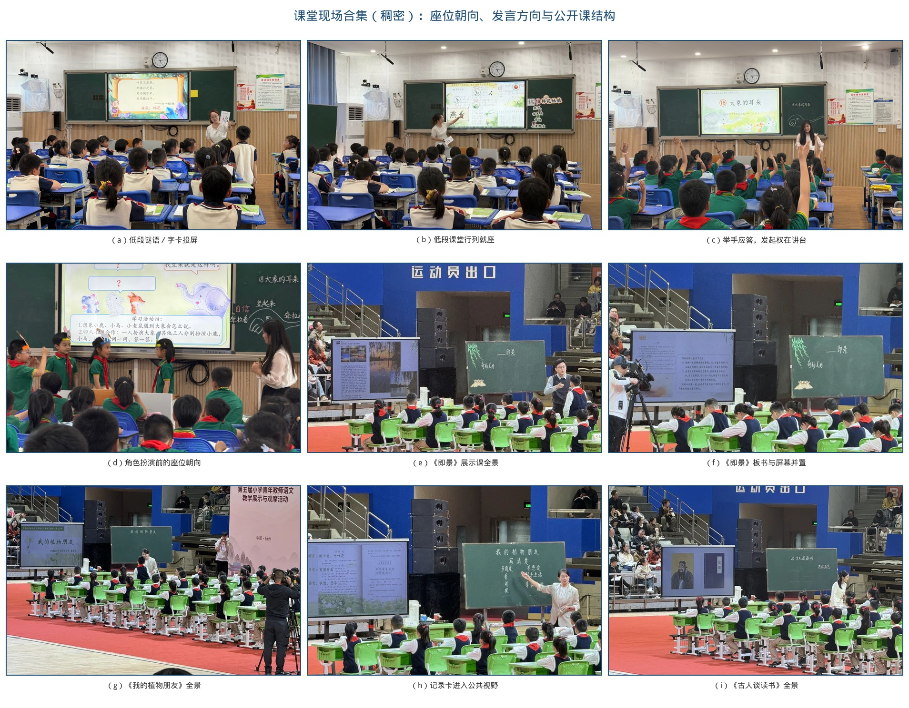
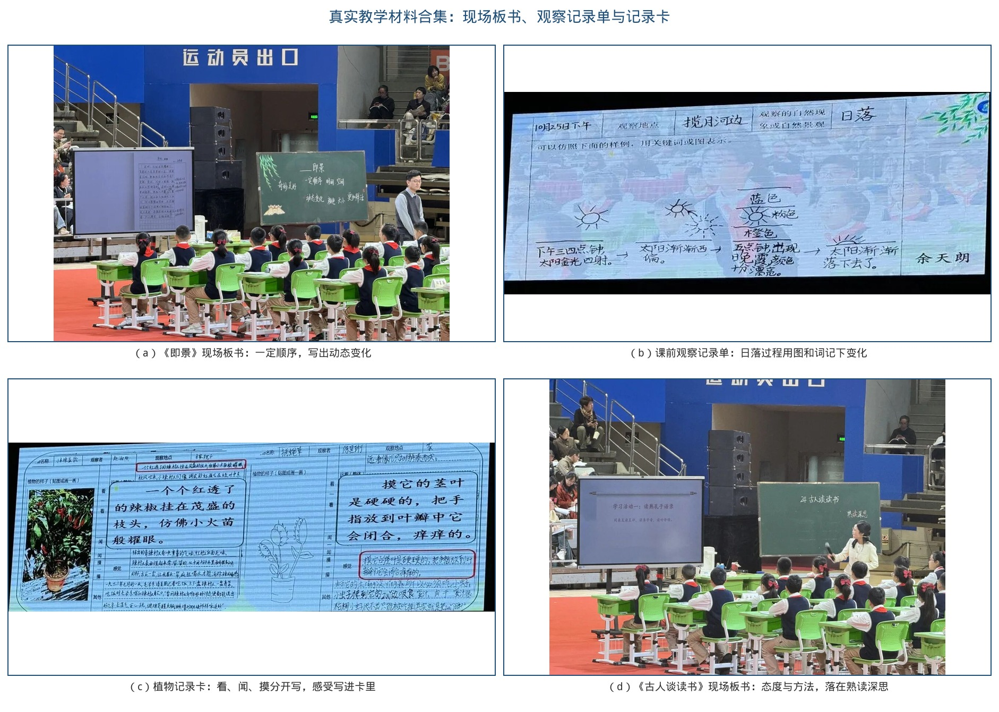
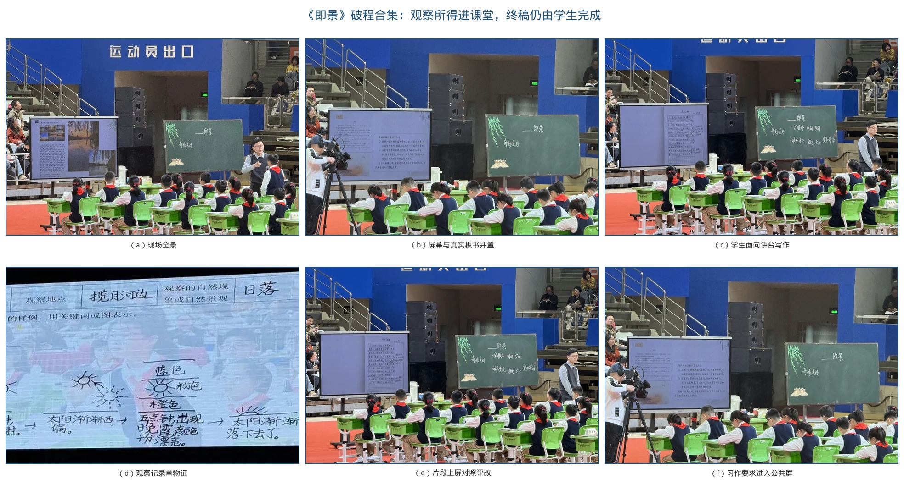
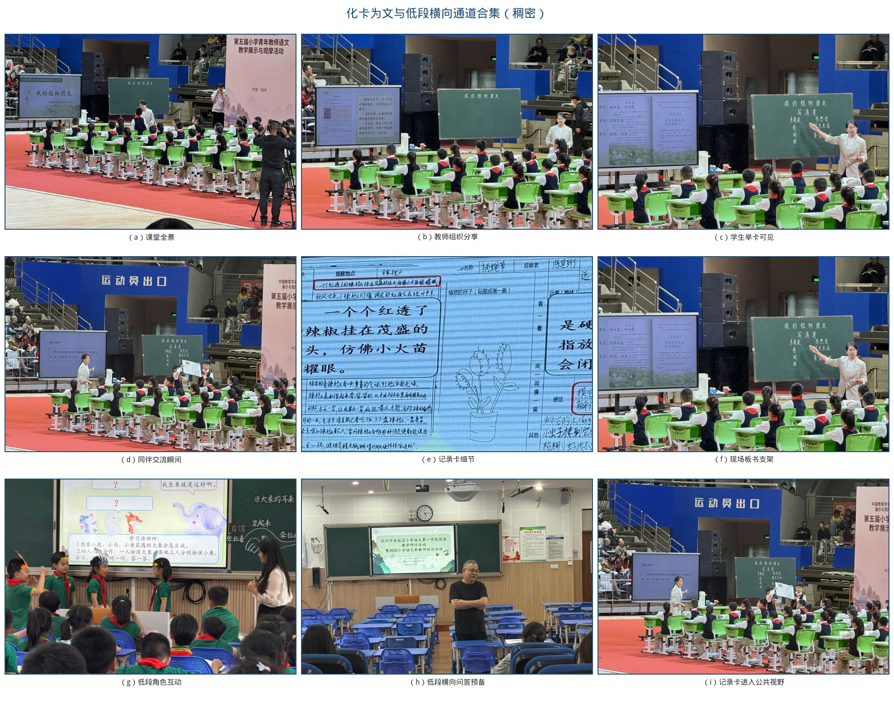
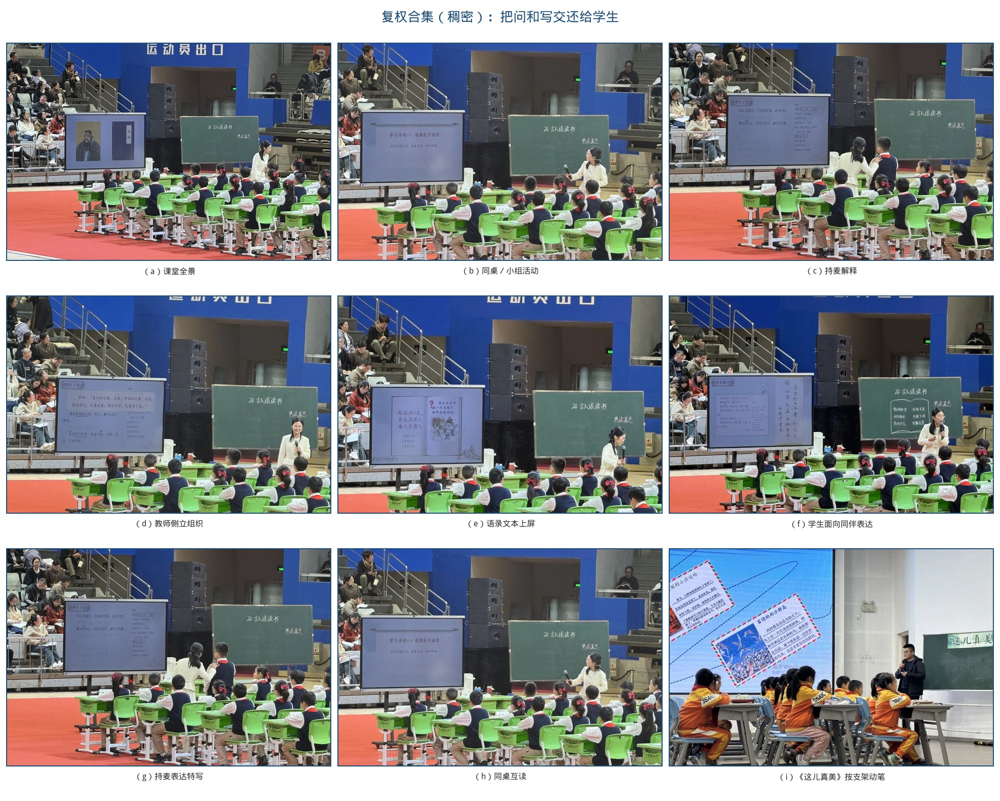

# 失衡·校准·均衡
# ——AI赋能下小学语文三元协同师生互动优化策略

**【摘要】**生成式人工智能进入小学语文课堂后，互动主体由“教师—学生”扩展为“教师—AI—学生”。已有研究较多讨论资源生成、分层练习与习作支架，对课堂互动的通道、权责与越位边界仍缺少可观察的校准框架。课堂观察与课例分析表明：若组织方式、权责关系与技术边界不同步调整，技术在场仍可能固化放射状问答、压缩部分学生的发言机会，并以人机输出代替概念交互与情意回应。《义务教育语文课程标准（2022年版）》强调平等对话；教育部基础教育教学指导委员会《中小学生成式人工智能使用指南（2025年版）》提出“育人为本、技术为用”，明确教师不得将生成式人工智能作为替代性教学主体，小学阶段学生不得独自使用开放式内容生成功能。本文以“问题—策略—结果”为线索，将形式、关系、技术三类失衡分别对应破程、复权、守界三阶校准，提出“三层互动×三元主体×三阶校准”模型，并给出可记录的行为编码与观察量表。本文认为：三元协同不是三方平均用力，而是使AI承担支架、教师承担引领、学生完成意义建构，推动互动由操作交互经信息交互进入概念交互，并由人守住情意回应。证据以课堂观察、课例分析与政策文本为主，公开报道数据仅作侧面说明，不外推为普遍因果效应。

**【关键词】**小学语文师生互动；三元协同；生成式人工智能；互动校准

## 三级目录

一、审视——三元协同课堂互动失衡之困
（一）形式失衡：程式问答，遮蔽多向互动
1. 通道单一：一呼百应，互动难以横向展开
2. 参与失衡：少数发言，主体难以全面进入
3. 生成受限：教案固化，课堂难以容纳意外
（二）关系失衡：主客固化，消解平等交往
1. 发起单向：教师独问，学生习惯被动应答
2. 表达失衡：少数独言，边缘学生持续旁观
3. 权责模糊：技术介入，师生关系反而弱化
（三）技术失衡：工具越位，遮蔽真实对话
1. 替答现象：机器给解，学生跳过自主思考
2. 替评现象：数据代言，情意回应难以替代
3. 替证现象：工具出场，被误认为课堂升级

二、探究——三元协同课堂互动校准之阶
（一）破程之阶：打开通道，让问答走向多向
1. 横向开道：梯度设问，互动得以横向展开
2. 全员入场：分层驱动，主体得以全面进入
3. 生成入课：偏差接住，课堂得以容纳意外
（二）复权之阶：校准主客，让发言走向全员
1. 问权下移：学生追问，改变被动应答习惯
2. 边缘可见：观点上屏，打破持续旁观格局
3. 三元归位：人守判断，防止关系再度弱化
（三）守界之阶：限制越位，让技术回归支架
1. 禁替终答：先思后比，守住自主思考过程
2. 护航情意：出错先护，评分不得当众惩戒
3. 证伪机器：据文校验，破除工具即升级观

三、反思——三元协同课堂互动均衡之效
（一）成效回望：参与拓宽，互动层次拾级而上
1. 行为证据：覆盖提问，同伴追问开始出现
2. 过程证据：文本作证，概念交互开始发生
3. 结果证据：公开案例，仅作侧面增量说明
（二）问题检视：技术惯性，情意回应尚有缺口
1. 惯性犹在：给终答易，给支架难成习惯
2. 素养落差：会操作易，会追问难成全员
3. 评价滞后：看次数易，看情意难入量表
（三）改进前瞻：课型适配，循证复盘持续生长
1. 课型分责：分型定界，识写表达各守边界
2. 观察入表：六维编码，覆盖层次情意对照
3. 单元复盘：支架终答，对照表达循环迭代

## 一、审视——三元协同课堂互动失衡之困
生成式人工智能进了小学语文课堂，互动主体多出一方，旧的问答结构却常常原样保留。全国教学展示课和区域第一学段阅读研讨的现场，把这一点摊得很清楚：学生仍坐成行列，目光对着屏幕或讲台，发言以举手应答为主。屏幕上可以出现谜语、任务要求和学生习作，这些只能说明信息已经公共化，不能说明对话已经转向多向。课堂互动本来就应当是双向的、连续的，人靠语言、神态和姿态去理解对方的意思，并据此调整自己的行为。学生若没有思考和表达的空隙，问题若不是从课文和生活里长出来的，教案之外冒出来的想法若接不住，互动就会退回“一问一答走流程”。本文要问的不是有没有用AI，而是谁在什么场景里缺了什么。通道打不开，发言权就会更集中；权责一模糊，生成式工具便容易把终答和评价一并接过去。所以下面先看形式，再看关系，最后看技术边界。

**图1　教学交互层次模型（操作—信息—概念，并守住情意共鸣）**

图1把这种互动分成三层来看。会点选、会投屏，只说明媒体操作已经发生；关键词和习作上了屏，只说明信息已经交换；新旧观念在课文证据上碰在一起，才算进到概念这一层。情意上的回应，算法包不下来，还得由人接着做完。通道若仍是放射状的，课就很难从操作、信息往上走。下面先看通道开了没有。

### （一）形式失衡：程式问答，遮蔽多向互动
形式失衡，就是把互动收成“教师一呼、学生百应”。教师与全体、教师与个别两条线占满课时，小组、生生、组际的横向通道进不去。深度互动不是被技术挡住的，是被这条放射状流程挡住的。

#### 1. 通道单一：一呼百应，互动难以横向展开
三年级寓言课上常见这样的节奏：教师站在投影前问“这个故事告诉我们什么道理”，全班齐答“不能心存侥幸”，一名表达流畅的学生补一句“要靠劳动”，课就进入下一环节。齐声应答听起来热闹，主体并未真正进入对话。区域研讨里的一年级《棉花姑娘》用谜语导入、出示“棉”字卡片，情境是打开了，座位仍是行列式，学生齐看屏幕。全国展示里的五年级习作《即景》、三年级习作《我的植物朋友》，课桌摆在体育馆里，朝向同样对着讲台。可见通道单一并不因公开课自动消失。若再把生成式工具给出的“标准寓意”直接投出，学生连涵泳和试错也省了，程式只会更光滑。

#### 2. 参与失衡：少数发言，主体难以全面进入
身体在场不等于话语在场。行列式座位里，发言容易集中到教师较熟悉、表达较流畅的学生身上；小组里也常见“一人说、众人听”。《大象的耳朵》课上，学生齐刷刷举手对着教师，发起权仍在讲台一侧。此处不把“近三分之一沉默”写成未交代样本的统计。可以观察的是：内向学生和表达较弱的学生，在放射状问答里更容易旁观。生成式工具本可以归集不同想法，若只用它做习题和投屏，技术在场，通道还是一条。

#### 3. 生成受限：教案固化，课堂难以容纳意外
教师担心小组活动打乱节奏，便把先问什么、谁来答、标准句是哪一句写进每一分钟。教案走完，互动也宣告结束。问法单一，根子是不敢把时间交给尚未写进教案的那句话。此时若再用生成式工具预先生产“标准赏析”，生成空间会更窄。形式这一层不打开，后面所谓平等交往和技术赋能，都会落在同一条放射线上。图2把四张现场放在一起，便于对照座位朝向和发言方向。

**图2　课堂现场合集：（a）《棉花姑娘》；（b）《大象的耳朵》；（c）《即景》；（d）《我的植物朋友》**

### （二）关系失衡：主客固化，消解平等交往
通道窄，发言权就会更集中。完整互动本应包含认知、情意和行为。关系失衡，是发起权、可见权、判断权持续握在教师和少数学生手里。

#### 1. 发起单向：教师独问，学生习惯被动应答
教师始终是问题发起者，学生只是执行者。问点落在字词句篇的标准解释上，学生出错时急于纠正答案，情绪来不及安抚，个性化态度更难展示。部分课堂把生成式工具当成扩音器：同一段赏析，过去写在教案里，现在由机器读出来，主客关系被“更正确的声音”加固。与预设不合的想法，常被一句“下课再聊”绕开。

#### 2. 表达失衡：少数独言，边缘学生持续旁观
发言集中于少数人，互动停在浅层，缺少碰撞。若只把活跃者的答案投上屏幕，边缘学生被看见的机会不会自动增加。《古人谈读书》里一名学生持麦克风解释语录，这是发起权下移的瞬间；其余学生仍坐成秧田，说明个别位置的复权，还不等于全员通道已经打开。应然状态应是：学生面向同伴说，教师退到一侧听，屏幕只承担支架。

#### 3. 权责模糊：技术介入，师生关系反而弱化
若把师生互动等同于课堂提问，交往进不了教学过程的基本构成。评价优先看进度和知识点覆盖，教师便不敢把时间交给开放探究。学生的倾听、表达、合作缺少常态训练，给了机会也不容易形成高质量对话。生成式人工智能进来后，若提问权和评价权再让给机器，教师容易变成播放者，学生容易变成校对者。关系这一层不校准，技术越流畅，主客越难松动。

### （三）技术失衡：工具越位，遮蔽真实对话
形式和关系没有校准，生成式工具就容易从支架变成越位的判断者：替学生思考，替教师判断，用人机问答充当情意交流。《中小学生成式人工智能使用指南（2025年版）》提出“育人为本、技术为用”，明确教师不得将其作为替代性教学主体，小学阶段学生不得独自使用开放式内容生成功能。UNESCO《教师人工智能能力框架》也指出，教学关系可以转为教师—AI—学生，核心仍是人的主体性。黄荣怀把数字化进阶写成环境、资源、数字教学法：停在设备在场，进不了教学法，容易高投入、低回报。

#### 1. 替答现象：机器给解，学生跳过自主思考
学生对着屏幕读标准赏析，教师点头，进入下一题。主体都在场，过程没有生成。直接输出寓意、中心思想或范文，学生跳过探究与试错，概念交互被切断。这也与《使用指南》禁止把生成内容直接作为作业或考试答案的要求相悖。

#### 2. 替评现象：数据代言，情意回应难以替代
用机器评分、活跃度统计代替现场研判，是第二类越位。活跃度低可能是性格、准备或问题过难，一个数字代替不了。当众展示带羞辱性的语音测评分数，学生下次更倾向选择安全答案，情意互动随之收缩。

#### 3. 替证现象：工具出场，被误认为课堂升级
把是否使用生成式人工智能当作课堂先进的证明，是第三类越位。操作层流畅，不等于概念层发生。UNESCO《2023年全球教育监测报告》提醒，教育技术影响的可靠证据仍然不足，技术不能取代教与学所依赖的人际连接。情感体察和价值判断仍须由人完成。三类失衡的识别与校准指向，收在表1；现场用过的板书和记录卡，则说明支架材料本身往往是清楚的，缺的是通道和权责。

**表1　三类失衡、识别信号与校准指向**

| 失衡类型 | 核心问题 | 可观察信号 | 校准指向 |
| --- | --- | --- | --- |
| 形式失衡 | 怎么互动 | 放射状问答、横向通道不足、教案不容意外 | 破程之阶：打开通道 |
| 关系失衡 | 谁拥有互动权 | 教师独问、少数独言、边缘学生旁观 | 复权之阶：归还权责 |
| 技术失衡 | 什么可以交给AI | 替答、替评、替演、替证 | 守界之阶：限制越位 |

**图3　真实教学材料合集：（a）《即景》板书；（b）日落观察记录单；（c）植物记录卡；（d）《古人谈读书》板书**

图3里的材料并不空洞。《即景》板书把“按一定顺序写”“写出动态变化”写在黑板上；观察记录单用简笔画记下太阳西偏、晚霞变色、渐渐落下；植物记录卡把看、闻、摸和感受分开写；《古人谈读书》板书把态度与方法收在“熟读深思”。这些都是可观察的支架。问题在于：支架上了屏、上了板，若座位和发言方向不变，课堂仍可能停在听讲。于是策略不能只谈“多用AI”，而要按通道、权责、边界拾级校准。

## 二、探究——三元协同课堂互动校准之阶
已有小学语文生成式人工智能研究，多做资源生成、分层练习和习作支架。王春梅概括为资源创新、方法优化与个性化学习，并指出虚假信息、思维惰化、教师角色转换困难与技术风险。贺琳珊、梅培军以童话创编为例，路径常是情境生成、即时反馈、智能评改。这些工作能降低表达门槛，却较少回答：通道如何从放射状转为多向，发言权如何回到全员，终答如何不交给机器。祝智庭的人机分工底线——机器做可重复的，人做判断的，二者结合做更合适的——要落到可观察的动作上。本文把动作写成破程、复权、守界。通道不开，复权会变成新的点名；权责不校准，守界停在口头；边界不守，前两阶都会被更流畅的标准答案吞掉。

**表2　已有研究关注点与本文校准指向**

| 已有研究常见做法 | 可借鉴之处 | 易出现的缺口 | 本文校准 |
| --- | --- | --- | --- |
| 生成问题库、练习与情境 | 降低备课中的材料准备成本 | 问题仍由教师独问，通道依旧单向 | 破程：梯度供问，先写后比 |
| 观察记录卡、习作支架、智能评改 | 把“写清楚”拆成可操作步骤 | 直接生成成文，或把评改分数当众展示 | 守界：卡与角度可生成，成篇须学生完成 |
| 学情画像、活跃度与正确率统计 | 提示哪些学生尚未开口 | 用数据代替情意研判 | 复权+护航：看见边缘，评分课后看 |
| 人机协同、师—机—生结构论述 | 明确结构已经三元化 | 三方平均用力，权责不清 | 三阶校准：支架、引领、建构各守其位 |

有效的三元协同，不是三方平均用力，而是AI承担支架、教师承担引领、学生完成意义建构。低年段开放式生成由教师发起并监护；中高年段逐步把提问权、校验权交给学生。课前可作一分钟对照：通道开了没有，权责正不正，边界守没守。

**图4　“三层互动×三元主体×三阶校准”理论模型**

**图5　权责与边界合集：（a）三阶校准；（b）三元权责；（c）宜做慎做；（d）介入强度；（e）绿灯黄灯红灯**

**表3　“教师—AI—学生”课堂互动权责简表**

| 主体 | 主要权责 | 不可越位之处 |
| --- | --- | --- |
| 教师 | 目标设计、价值引领、情感沟通、即时调控、甄别生成内容 | 不把育人判断交给算法 |
| AI | 素材与情境生成、学情归集、观点汇总、分层提示、可重复反馈 | 不直接给出本应由学生完成的终答 |
| 学生 | 自主探究、同伴协作、有效提问、校验信息、真实表达 | 不照搬生成语句代替自己的思考 |

### （一）破程之阶：打开通道，让问答走向多向
对应形式失衡。先改问题，再改任务，再决定是否调用工具。通道一开，程式才松得动。

#### 1. 横向开道：梯度设问，互动得以横向展开
少问“是不是、对不对”，改问能让学生选择思路的问题。生成式工具可以按由易到难供四层问题，教师删掉“标准答案型”设问；学生先独立写关键词、同桌互说，再全班比读；所谓“标准描写”先折叠，写完再打开对照。三年级《火烧云》可按“颜色变化—形状联想—动态用词—情感余味”供问，规则写明：问题可以借用，美文先不看。一上课就投“标准美文”，通道会立刻闭合。

同一思路落到五年级《即景》，就不再从空讲“动态描写”开始。教材要求观察一种自然现象或一处景观，按一定顺序写出景物变化；学生此前已写过《这儿真美》《游　　》。课前完成观察记录单，课上先比较何为“眼前的、当下的景”，再交流心动时刻、补全题目；默读教材圈出“顺序”和“变化”；回看记录单决定时间顺序还是空间顺序；迁移《鸟的天堂》《月迹》里声音、数量、光影的写法，重点改“变化有没有写出来”。图3（b）那张日落记录单，已经用“金光四射→渐渐西偏→晚霞变色→落下去”把过程画出来了。生成式工具此时只宜给观察角度或动态动词，不宜生成成篇即景作文。图6把观察单、教材要求、学生片段和板书放在一起：材料进了公共屏幕，评改才有对象；终稿仍须学生写。

**图6　《即景》破程合集：观察记录单、教材要求、学生片段与板书支架**

#### 2. 全员入场：分层驱动，主体得以全面进入
空间上打开还不够，任务也要分层，让不同学生都有事可做。低年级宜同桌互说互查；高年级宜小组兼组际。工具进课堂要有顺序：先明确任务，再决定何时调用，何时必须回到文本和同伴。

四年级《我们家的男子汉》可设三层任务：A层找出写言行的句子并朗读，B层讨论为何用这一称呼，C层写“我们家的——”。提示卡不含现成赏析。课后“我与AI辩论”须在教师组织下进行：学生先写约100字，再对照生成文字标出同意、不同意、课文里有没有证据。A层同样要被追问“为什么这样读”，分层不是降要求。

三年级《我的植物朋友》难在观察角度单一、不会把记录卡连成文。教材本身就是三步：课前做记录卡，课中借助卡来写，课后修改并交流。课上先分享卡、交流“从哪些方面观察”，再补充记录卡，然后选一两个方面化卡为文，写清楚观察到的，试着写出感受。关联《荷花》的多感官写法，把看、闻、摸变成可选路径。图3（c）里，学生已经把“红透了的辣椒”和“茎叶硬硬的、会闭合”写进卡；图7（b）板书把“写清楚、多角度、有感受”立在黑板上。生成式工具可以提示角度或把口语转成提纲，终稿必须学生完成。区域习作集备提出的“赋能·分层·共生”，说的也是支架分层供给、互评修改共生，而不是用同一篇范文覆盖全班。

低段更不宜一上来“人机辩论”。《棉花姑娘》要落实的是读好请求语气，角色扮演比生成解释更要紧；《大象的耳朵》抓住问号、语气词读对话，四人一组扮演大象与小动物，学生之间开始一问一答。图7（d）里，横向通道出现在角色之间，而不是出现在屏幕上的标准答案里。图画和情境是帮手，不是主角。判断标准是：学生是否更愿意读、更敢于说。

**图7　化卡为文与低段横向通道：（a）（b）（c）《我的植物朋友》；（d）《大象的耳朵》角色扮演**

#### 3. 生成入课：偏差接住，课堂得以容纳意外
备课宜粗备框架、细留空间。课中出现教案外的问题，可以调用工具获取多角度参考，但不宣读答案，而把它变成研讨引子。接住的标志是：把学生的那句话写上黑板，追问课文里有没有依据，再决定要不要补材料。

《守株待兔》里若有学生说“守株人也许只是太累了”，不要急于纠偏。可问：课文有没有写他累？作者为什么写得这么夸张？再提供“寓言夸张”和“侥幸心理”两类材料，正反双方用课文语句说话。教师既不否定学生，也不让机器给终答，讨论才能回到文本证据。破程打开的是通道；通道上若仍是教师独问，还要把问权往下移。

### （二）复权之阶：校准主客，让发言走向全员
对应关系失衡。通道打开之后，若仍是“师问生答”，多向互动会很快被少数人重新垄断。

#### 1. 问权下移：学生追问，改变被动应答习惯
把“问”教给学生，并规定：向生成式工具提问，不得直接索要终答。句式可做成微型课，贴在语文书首页。

**表4　学生向AI提问的支架句式**

| 使用场合 | 不建议这样问 | 建议这样问 |
| --- | --- | --- |
| 预习阶段 | “这篇课文讲了什么？” | “课文中哪几处写到了××？分别在第几段？” |
| 阅读探究 | “帮我分析这句话的作用。” | “这句话如果删掉，意思会有什么不同？” |
| 表达交流 | “帮我写一段关于××的话。” | “我的这段文字，哪里写得还不够清楚？” |
| 校验信息 | “你说得对吗？” | “你的依据在课文哪一句？我能不能找到反例？” |

《古人谈读书》说理性强，语录句之间关联不高，学生不容易主动联系自己的读书生活。课上可把提问权前移：同桌互读互评，读准“知、识、诲”，读好长句停顿；自读提出疑问，借助注释在小组内理解大意；用表格梳理朱熹“心到、眼到、口到”；最后联系自己的读书体会说启发，把喜欢的句子抄到书签上。图8（a）屏幕写的是“学习活动一：读熟孔子语录，同桌互读互评”，任务已经指向同伴；图8（b）学生持麦解释，教师侧立。生成式工具可以提供注释对照或停顿示例，不能代替学生说出“我读到了什么、以后怎么读”。

#### 2. 边缘可见：观点上屏，打破持续旁观格局
破解垄断，不是多点几个名字，而是让每个想法被看见。投屏不是展览，而是下一轮对话的起点。三年级《这儿真美》一类课，可用教材例文学“围绕一个意思写”，再用量规组织练笔和修改，使边缘学生按可见标准进入表达。图8（d）里，例文上了屏，学生已经在本子上写；教师的工作是组织比较和修改，而不是把范文读完了事。《手指》一课则把各组关键词归集投屏，先请一组说归类理由，再请另一组补充或反驳，最后为关键词找课文依据。归集可以交给工具，冲突处理仍是教师的专业工作。

**图8　复权合集：（a）（b）（c）《古人谈读书》；（d）《这儿真美》按支架动笔**

#### 3. 三元归位：人守判断，防止关系再度弱化
课堂上是否复位，看两个瞬间：学生说出与预设不同的答案时，教师是接住还是绕开；生成式工具给出看似标准的解读时，教师是宣读还是追问。《守株待兔》可不急于揭示“不可心存侥幸”，先让学生用自己的话说故事，再请工具扮演“守株人”辩解，学生追问庄稼谁来种、兔子会不会再来。工具只负责把问题归类投屏，教师抓住“侥幸—劳动—事理”组织对话。生成文本可以连贯，但不等于课文意义本身。判断仍须放到文本证据里，由学生比照、质疑、论证。关系校准之后，还要把终答和评分从机器手里拿回来。

### （三）守界之阶：限制越位，让技术回归支架
对应技术失衡。通道有了，权责明了，若没有不可逾越的边界，工具仍会以更精致的方式替答、替评、替证。

#### 1. 禁替终答：先思后比，守住自主思考过程
可以给问题、给材料、给归集，不可以给本课终答。“标准赏析”折到学生独立表达之后，只作对照。习作同样：角度、情节提示、病句提醒可以生成，成篇文字须学生完成。这与小学阶段限制独自开放生成、禁止复制生成内容作为作业答案相一致，也针对“照抄生成结构与语句”的惰化风险。图6、图7里的观察单和记录卡，正是“卡可生成、文须人写”的现场注脚。

#### 2. 护航情意：出错先护，评分不得当众惩戒
学生读错、说错时，先护住再回到文本。当众不展示带羞辱性的机器分数；先问“你刚才看到了什么／想到了什么”，再范读或同伴带读；分数留到课后单独看，与自己的下一次进步对照，不与全班排名对照。《火烧云》朗读里若有学生把比喻读破，语音测评分数再低，也不投到全班眼前。先问颜色、肯定观察，再带着读。机器评价一旦当众生效，学生下次会更倾向安全答案。

#### 3. 证伪机器：据文校验，破除工具即升级观
对生成的释义、赏析、学情标签要审慎：活跃度低不能直接等同于“不认真”。更要紧的是当着学生的面质疑生成内容。任何生成句子上屏，都要经过“课文里有没有依据”这一问。《守株待兔》拓展里若出现“等待也是一种策略”，就把这句话投上屏，请学生找：庄稼完了没有，邻居怎么说，宋人结果如何。文本不支持，就不能把流畅句当成意义建构。学生看见教师当场质疑工具，“机器说的就是对的”才会松动，概念交互才进得去。

**图9　守界课例合集：（a）《守株待兔》流程；（b）生成句上屏后必须被追问**

提问句式、倾听规则和“先找课文、再看机器”，宜做成单元常规。各课例的人机分工收在表5。

**表5　主要课例的三元分工与互动升级点**

| 课例 | 主要互动设计 | AI承担 | 互动升级点 |
| --- | --- | --- | --- |
| 《火烧云》 | 梯度设问，先写后比 | 生成问题梯度 | 由浅层应答转向多层表达 |
| 《火烧云》二 | 不当众展示机器评分 | 语音测评（课后查看） | 由评价驱动转向情感支持 |
| 《守株待兔》 | AI扮角色，学生追问 | 角色辩解、问题归集 | 由听讲转向质疑与论证 |
| 《即景》 | 观察记录单＋动态描写 | 观察角度／动词提示（不生成成文） | 由静景罗列转向变化表达 |
| 《我的植物朋友》 | 化卡为文＋同伴分享 | 观察角度提示 | 由记录转向连贯表达 |
| 《古人谈读书》 | 同桌互读＋自读提问＋持麦解释 | 注释对照、停顿示例 | 由听讲转向质疑与迁移 |
| 《棉花姑娘》《大象的耳朵》 | 情境朗读、角色对话 | 不替代朗读体验 | 由认读转向语气与思维 |
| 《手指》 | 小组关键词归集投屏 | 归集与可视化 | 由少数发言转向全员表达 |
| 《我们家的男子汉》 | 三层任务＋课后辩论 | 分层提示卡 | 由课中互动转向链环互动 |
| 《这儿真美》《奇妙的想象》 | 写作支架＋评价量规＋互评 | 不提供范文终稿 | 由教师改文转向学生修改 |

## 三、反思——三元协同课堂互动均衡之效
校准有没有效，不能只看这节课用不用生成式人工智能，而要同时看证据等级，并按过去、现在、未来来说。证据分三层：行为上是否覆盖提问、同伴追问、校验生成内容；过程上是否使用文本证据、是否修改与质疑；结果上表达、理解、朗读、兴趣是否变化。本文用课例分析、课堂观察、政策文本和文献对读，课例来自统编教材常态课、全国教学展示和区域阅读研讨、习作集备，只讨论教学设计与互动结构，不标注执教者个人身份。观察用于识别结构，不作未交代样本的统计推断。公开报道中的准确率标明来源，不作为本文实验数据。

### （一）成效回望：参与拓宽，互动层次拾级而上
就已开展的课例与观察而言，能说的是结构与行为的变化方向，不是未完成抽样设计的参数估计。

#### 1. 行为证据：覆盖提问，同伴追问开始出现
过去，放射状问答使部分学生整节课缺少有效发言，小组里一人说、众人听。现在，《即景》用观察记录单让每个学生课前就有话可写；《我的植物朋友》让记录卡进入公共屏幕；《古人谈读书》用同桌互读把第一轮发言交给同伴；《大象的耳朵》用角色扮演让学生互相问答。内向学生不必第一时间当众成段发言，也可以经由卡片、小组和扮演被看见。覆盖的意义不在热闹，而在边缘学生不再被固定排除。图2说明旧通道仍在，图7、图8说明新通道可以出现——二者要对照着看，不能用展示课照片证明问题已经消失。

#### 2. 过程证据：文本作证，概念交互开始发生
过去，互动在“找出关键词、齐答道理”的信息层循环。现在，《守株待兔》用课文证伪流畅的“正能量改写”；《即景》先观察、先写后改，不把机器美文当范本；《我的植物朋友》把看闻摸的记录化成有感受的连贯表达；《古人谈读书》让学生提出疑问并联系自己的读书生活。这些行为落在分析、评价、质疑区间，是信息交互向概念交互的移动。图3、图6中的记录单和板书，是过程证据的物证：变化有没有写出来，可以拿卡和文对照，而不必先问机器。

#### 3. 结果证据：公开案例，仅作侧面增量说明
第三层结果，本文不以自制前后测冒充实验。侧面说明可引用已公开报道：北京师范大学京师附属小学在三年级《在牛肚子里旅行》等相关朗读实践中，报道称一篇课文预习的班级平均发音准确率由初测82%提升至课后测94%，并强调教师据此把握共性问题、组织课堂指导。该数据只说明AI可承担可重复的朗读反馈、教师仍须组织教学与情感回应，不能推广到阅读鉴赏或习作。区域科学课里智能体做组间互评，评价标准仍由教师定，语文课同样：归集可以交给机器，判断必须留在人。

### （二）问题检视：技术惯性，情意回应尚有缺口
均衡是目标，不是已经完成的状态。图2里的行列式和图7（d）里的扮演同时存在，说明缺口还没有闭合。

#### 1. 惯性犹在：给终答易，给支架难成习惯
公开课上教师能守住“不给终答”；日常进度压力下，仍容易随手投出标准解读，换取“这节课讲完了”。给支架更费时间：要筛选问题、折叠答案、组织比读。技术惯性叠上进度焦虑，破程会回潮为更精致的程式化。图6（c）学生片段上了屏，若评改仍由教师宣读标准句，通道等于没开。

#### 2. 素养落差：会操作易，会追问难成全员
学生会打开平台、会输入关键词，不等于会问“这句话如果删掉会怎样”。提问句式在部分课例中有效，尚未变成年级常规；有的学生仍把工具当成代写器。全员可见若只停留在“屏幕上有名字”，复权就停在工具层，进不了素养层。

#### 3. 评价滞后：看次数易，看情意难入量表
学校和教研仍习惯统计发言次数、工具出场、知识点覆盖。学生出错时是否被保护、是否敢于再试，很难进量表，护航常被看成教师风格。以用代证的评课习惯不改，守界就缺少制度支持。数据可以提示发生了什么，不能代替教师判断该不该这样互动。

### （三）改进前瞻：课型适配，循证复盘持续生长
下一步不是另立提法，而是把已经有效的校准做成不同课型可执行、每单元可复盘的日常。

#### 1. 课型分责：分型定界，识写表达各守边界
识字写字重情境与即时反馈，阅读鉴赏重问题与可视思维，口语交际重真实交流，习作重独立表达与修改，综合实践重真实探究。终答、范写、价值判断一律留在人这边。图5（e）的绿灯、黄灯、红灯，可直接贴进教研评课。

**表6　课型适配矩阵（策略落地总表）**

| 课型 | AI宜做 | AI慎做 | 教师重点 | 学生核心任务 |
| --- | --- | --- | --- | --- |
| 识字写字 | 情境生成、字形提示 | 直接替学生识记 | 音形义把关 | 观察、辨析、运用 |
| 阅读鉴赏 | 问题生成、观点归集 | 直接生成中心思想 | 追问、证据判断 | 批注、质疑、论证 |
| 口语交际 | 情境模拟、角色陪练 | 替学生完成表达 | 组织真实交流 | 表达、倾听、回应 |
| 习作 | 观察角度提示、提纲反馈、病句提醒 | 直接生成成文或“标准范文” | 指导构思、量规互评与修改 | 观察记录、独立表达、修改 |
| 综合实践 | 资料整理、信息聚类 | 替代真实调查 | 任务设计与价值判断 | 探究、协作、创造 |

#### 2. 观察入表：六维编码，覆盖层次情意对照
评课要从“用了几个工具”转到可记录的行为。六维雷达只作框架示意，不填无完整数据的前后分数；批判校验单列，看是否质疑生成内容。弗兰德斯互动分析系统及顾小清等改进的ITIAS，把课堂言语分成教师语言、学生语言与沉寂或技术。生成式人工智能进场后，“技术”一栏过于笼统。本文在教师—学生轴上增列AI行为：生成、归集、提示、反馈、可视化，并规定可观察互动链T→S、T→AI→S、S→AI→S、S→S、T→S→T。编码供录像摘记，不在未做一致性检验时报告比率。

**图10　成效与观察工具合集：（a）公开朗读反馈（非本文实验）；（b）六维观察示意；（c）T/S/AI编码**
数据来源：首都之窗等对京师附小相关教学展示的公开报道。

**表7　AI赋能小学语文课堂互动质量观察量表**

| 维度 | 观察指标 | 0分 | 1分 | 2分 | 3分 |
| --- | --- | --- | --- | --- | --- |
| 问题开放度 | 是否存在分析、比较、评价、创造问题 | 无 | 偶有 | 较多 | 连续出现 |
| 参与覆盖 | 是否突破少数学生发言 | 严重集中 | 较集中 | 基本覆盖 | 高度覆盖 |
| 互动层次 | 是否由信息交互进入概念交互 | 操作 | 信息 | 概念 | 概念+情意 |
| 学生主体 | 学生是否主动提出问题 | 无 | 偶有 | 较多 | 稳定发生 |
| 人机边界 | AI是否替代学生思考 | 明显越位 | 偶有 | 基本合理 | 清晰受控 |
| 情意回应 | 学生受挫后是否获得支持 | 无 | 较少 | 较充分 | 持续发生 |
| 批判校验 | 是否质疑AI输出 | 无 | 偶有 | 较多 | 常态化 |

**表8　课中多向互动观察简表（供教师课后复盘）**

| 观察项目 | 观察要点 | 等级（优／良／待改进） | 编码摘记 |
| --- | --- | --- | --- |
| 问题开放度 | 是否出现需要分析、比较、创造的发散性问题 |  | T1/T2 |
| 参与覆盖面 | 发言是否超出少数固定学生，小组是否人人有任务 |  | S1/S5 |
| 交互层次 | 是否从操作交互、信息交互进入概念交互 |  | S4/S6 |
| 人机边界 | 是否只提供支架，终答是否由学生完成 |  | AI1–AI5 |
| 情意回应 | 学生受挫或出错时是否保护自尊并继续对话 |  | T4 |
| 倾听与质疑 | 是否出现同伴追问、补充或对生成内容的校验 |  | S2/S3/S4 |

#### 3. 单元复盘：支架终答，对照表达循环迭代
区域习作教研已形成可迁移的备课闭环：个人初备成个案，集体研讨成共案，个性化修改成特案，课后反思成定案。同课异构里，一类课重规性支架与评价量规，一类课重任务驱动与活性情境，二者都要把“写什么、怎么写、用什么标准改”对学生可见。建议以单元为周期，把这一闭环与观察量表、课堂实录合起来，专门比较“AI给终答”和“AI只给支架”两种设计下学生表达的差异。复盘看的不是工具出场次数，而是信息交互有没有抵达概念交互，情意回应有没有发生。

**表9　课后循证复盘记录表**

| 复盘项目 | 记录要点 | 本轮发现 | 下轮改进 |
| --- | --- | --- | --- |
| 目标达成 | 本节课的核心问题是否被多数学生触及 |  |  |
| 参与结构 | 发言学生的分布，是否存在固定的沉默群体 |  |  |
| 人机分工 | 哪些环节提供了支架，哪些环节替代了思考 |  |  |
| 情意回应 | 学生出错、受挫时教师的处理方式与效果 |  |  |
| 生成处理 | 教案之外的生成是否被接住 |  |  |
| 证据层级 | 本课主要获得的是行为、过程还是结果证据 |  |  |

三元协同是否成立，最终看三件事是否同时改善：发言覆盖是否拓宽，互动是否由信息层进入概念层，情意回应是否仍由人承担。图2提醒旧结构还在，图3、图6、图7、图8提供了可以接着做的支架与现场。校准按破程、复权、守界往下走；均衡是阶段性改善，缺口还要靠单元复盘去收。

## 参考文献
[1] 中华人民共和国教育部. 义务教育语文课程标准（2022年版）[S]. 北京：北京师范大学出版社，2022.
[2] 教育部基础教育教学指导委员会. 中小学生成式人工智能使用指南（2025年版）[S]. 2025.
[3] 教育部基础教育教学指导委员会. 中小学人工智能通识教育指南（2025年版）[S]. 2025.
[4] 教育部教师队伍建设专家指导委员会. 教师生成式人工智能应用指引（第一版）[S]. 2025.
[5] UNESCO. AI competency framework for teachers[R]. Paris: UNESCO, 2024.
[6] UNESCO. AI competency framework for students[R]. Paris: UNESCO, 2024.
[7] UNESCO. Guidance for generative AI in education and research[R]. Paris: UNESCO, 2023.
[8] 叶子，庞丽娟. 师生互动的本质与特征[J]. 教育研究，2001(4)：30-34.
[9] 佐斌. 师生互动论——课堂师生互动的心理学研究[M]. 武汉：华中师范大学出版社，2002.
[10] 叶澜. 让课堂焕发出生命活力——论中小学教学改革的深化[J]. 教育研究，1997(9)：3-8.
[11] 陈丽. 远程学习的教学交互模型和教学交互层次塔[J]. 中国远程教育，2004(5)：24-28.
[12] 祝智庭，韩中美，黄昌勤. 教育人工智能（eAI）：人本人工智能的新范式[J]. 电化教育研究，2021，42(1)：5-15.
[13] 顾小清，王炜. 支持教师专业发展的课堂分析技术新探索[J]. 中国电化教育，2004(7)：18-21.
[14] 方海光，高辰柱，陈佳. 改进型弗兰德斯互动分析系统及其应用[J]. 中国电化教育，2012(10)：109-113.
[15] 余文森. 核心素养导向的课堂教学[M]. 上海：上海教育出版社，2017.
[16] 米德. 心灵、自我与社会[M]. 赵月瑟，译. 上海：上海译文出版社，2018.
[17] 陈晓波. 数字技术赋能小学语文课堂教学：路径与策略[J]. 语文建设，2023(12)：10.
[18] 范佳荣，钟绍春. 人工智能技术引领下课堂教学数字化转型的本质认识、实践困境与突破路径[J]. 教育科学研究，2023(4)：11.
[19] 余胜泉. 教育数字化转型的关键路径[J]. 华东师范大学学报（教育科学版），2023，41(3)：62.
[20] 北京市人民政府. 人工智能赋能教育新生态　西城区学校展示数智技术重塑教学实践[EB/OL]. (2025-12-24)[2026-09-15]. https://www.beijing.gov.cn/ywdt/gqrd/202512/t20251224_4360512.html.
[21] 黄荣怀. 数字技术赋能当前教育变革的内在逻辑——从环境、资源到数字教学法[J]. 中国基础教育，2024(1)：10-17.
[22] UNESCO. Global education monitoring report 2023: Technology in education — A tool on whose terms?[R]. Paris: UNESCO, 2023.
[23] 王春梅. 生成式人工智能赋能小学语文教学的探索[J]. 实验教学与仪器，2025，42(8)：141-144.
[24] 贺琳珊，梅培军. 生成式人工智能赋能小学语文习作教学模式探索——以文心一言辅助《我来编童话》习作教学为例[J]. 中小学课堂教学研究，2025(3)：48-53.
